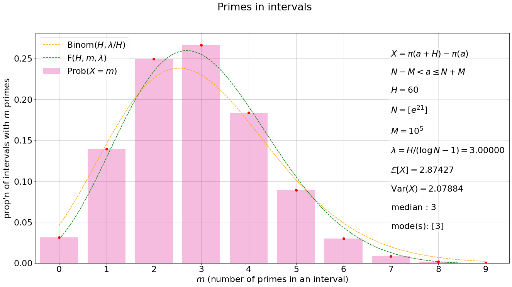
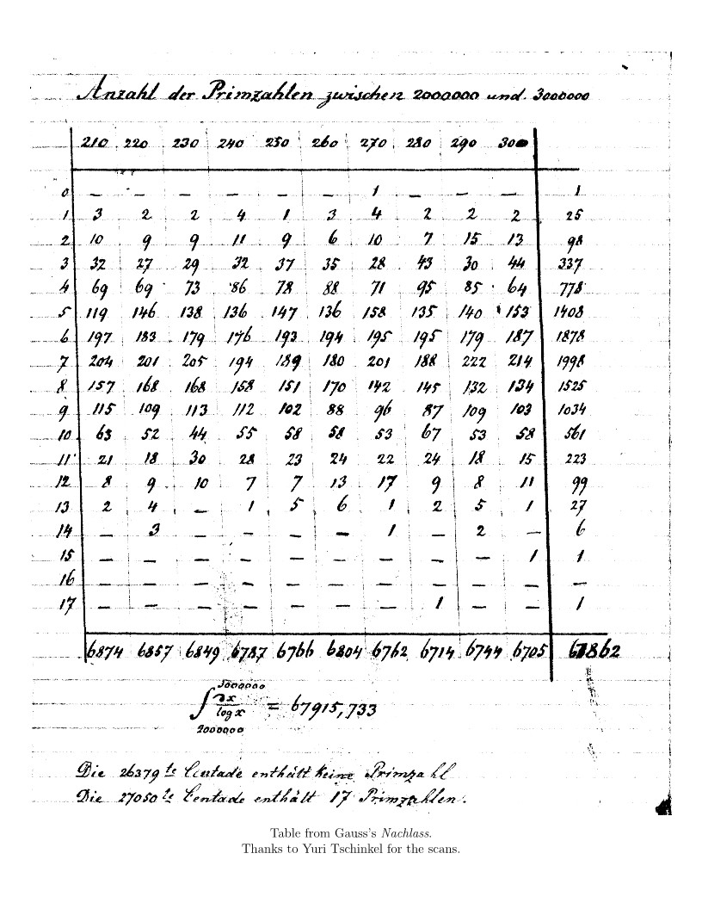
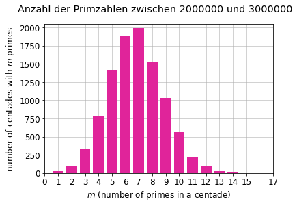
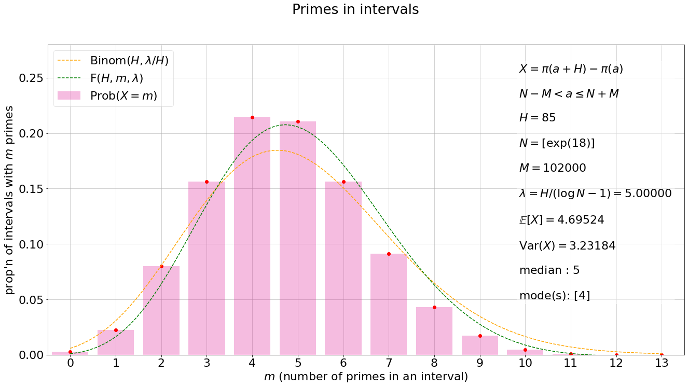
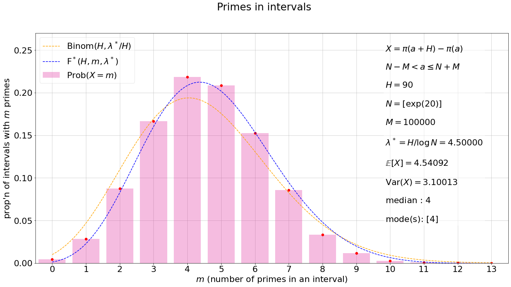
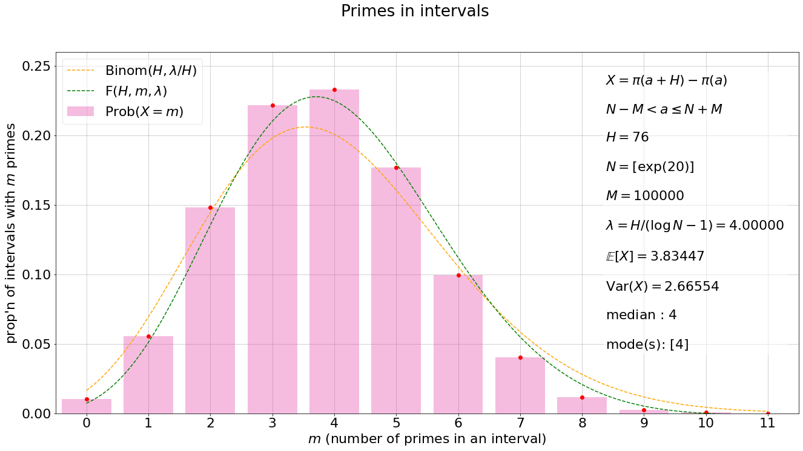

## Biases in the distribution of primes in intervals

<a id='tldr'></a>
### TL;DR
<sup>Jump to: ↓↓ [Contents](#contents) | ↓ [Introduction](#introduction) </sup>

The histogram shows the distribution of primes in intervals. Cramér's random model leads to a prediction for this distribution, shown in orange. We have another prediction, shown in green. In the data we've looked at, as here, our prediction seems to fare better than the one based on Cramér's model. 

As suggested in [[1]](#references), our prediction is based on the Hardy-Littlewood prime tuples conjecture, inclusion-exclusion, and a precise estimate, due to Montgomery and Soundararajan [[3]](#references), for a certain average involving the singular series of the prime tuples conjecture. 



The prediction of Cramér's random model (orange) is, with $\lambda/H = 1/(\log N - 1)$ being the "probability" that an integer close to $N$ is prime (and we assume $\lambda \asymp 1$),

$$\mathrm{Binom}(H,\lambda/H) =  \frac{e^{-\lambda}\lambda^m}{m!}\bigg[1 + \frac{Q_1(\lambda,m)}{H} + \frac{Q_2(\lambda,m)}{H^2} + \cdots\bigg],$$
where each $Q_j(\lambda,m)$ is a polynomial in $\lambda$ and $m$, and in particular, 

$$Q_1(\lambda,m) = \frac{m - (m - \lambda)^2}{2}.$$

Our prediction (green) is 

$$F(H,m,\lambda) = \frac{e^{-\lambda}\lambda^m}{m!}\left[1 + \frac{Q_1(\lambda,m)}{H}\left(\log H + (\log 2\pi + \gamma - 1)\right) \right],$$

in agreement with Cramér's model only as a first-order approximation. The secondary term in our prediction is more in line with our observation that the distribution of the numerical data is more "pinched up" around the center: there is more of a _bias_ towards the mean $\lambda$ than is suggested by the Binomial distribution.

<a id='introduction'></a>
### Introduction
<sup>Jump to: ↓ [Contents](#contents) | ↑ [TL;DR](#tldr)</sup>

Excerpt from letter from Gauss to his student Johann Franz Encke, December 24, 1849 (see [[4]](#references)).

_In 1811, the appearance of Chernau's cribrum gave me much pleasure and I have frequently (since I lack the patience
for a continuous count) spent an idle quarter of an hour to count another chiliad here and there; although I eventually gave it up without quite getting through a million. Only some time later did I make use of the diligence of **Goldschmidt** to fill some of the remaining gaps in the first million and to continue the computationa ccording to Burkhardt’s tables. Thus (for many years now) the first three million have been counted and checked against the integral. A small excerpt follows..._





<a id='contents'></a>
### Contents
<sup>Jump to: ↑ [Introduction](#introduction) | ↓ [Libraries](#libraries) </sup>

[TL;DR](#tldr)<br>
[Contents](#contents)<br>
[Introduction](#introduction)<br>
[Libraries](#libraries)<br>
[Generate](#generate)<br>
..........[Sieve](#sieve)<br>
..........[Count](#count)<br>
..........[Disjoint intervals](#disjoint)<br>
..........[Disjoint intervals, with checkpoints](#disjoint_checkpoints)<br>
..........[Overlapping intervals](#overlapping)<br>
..........[Overlapping intervals, with checkpoints](#overlapping_checkpoints)<br>
..........[A single function](#single_function)<br>
..........[To do](#to_do)<br>
[Raw data](#raw_data)<br> .......... [Example 1](#eg1generate) | [Example 2](#eg2generate)<br>
[Save](#save)<br> .......... [Example 1](#eg1save) | [Example 2](#eg2save)<br>
[Retrieve](#retrieve)<br> .......... [Example 1](#eg1retrieve) | [Example 2](#eg2retrieve)<br>
[Narrow](#narrow)<br> .......... [Example 1](#eg1narrow) | [Example 2](#eg2narrow)<br>
[Partition](#partition)<br> .......... [Example 1](#eg1partition) | [Example 2](#eg2partition)<br>
[Analyze](#analyze)<br> .......... [Example 1](#eg1analyze) | [Example 2](#eg2analyze)<br>
[Compare](#compare)<br> .......... [Example 1](#eg1compare) | [Example 2](#eg2compare)<br>
[Display](#display)<br> .......... [Example 1](#eg1display) | [Example 2](#eg2display) | [Example 3](#eg3display) (table from Gauss's _Nachlass_)<br>
[Plot & animate](#plot)<br> .......... [Example 1](#eg1plot) | [Example 2](#eg2plot)<br>
[Worked examples](#worked)<br> .......... [Example 4](#eg4worked) | [Example 5](#eg5worked)<br>
[Extensions](#extensions)<br>
[References](#references)<br>

<a id='libraries'></a>
### Libraries
<sup>Jump to: ↑ [Contents](#contents) | ↓ [Generate](#generate) </sup>

```python
# LIBRARIES
from itertools import count # used in the postponed_sieve prime generator
import sqlite3 # to save and retrieve data from a database
import pandas as pd # to display tables of data
from timeit import default_timer as timer # to see how long certain computations take
import numpy as np # for square-roots, exponentials, logs, etc.
from scipy.special import binom as binom # binom(x,y) = Gamma(x + 1)/[Gamma(y + 1)Gamma(x - y + 1)]
from scipy.special import gamma as gamma # Gamma function
from scipy.stats import norm
import sympy # for the Euler-Mascheroni constant, EulerGamma, in the constant 1 - gamma - log(2*pi) from Montgomery-Soundararajan
import matplotlib.pyplot as plt # for plotting distributions
from matplotlib import animation # for animating sequences of plots
from matplotlib import rc # to help with the animation
from IPython.display import HTML # to save animations
from matplotlib.animation import PillowWriter # to save animations as a gif
```

<a id='generate'></a>
### Generate
<sup>Jump to: ↑↑ [Contents](#contents) | ↑ [Libraries](#libraries) | ↓ [Sieve](#sieve) </sup>

Here we define a series of functions that will help us generate dictionaries containing information about primes in intervals. In the end, we will use the two functions ```disjoint_cp``` and ```overlap_cp``` ([disjoint](#disjoint) and [overlapping](#overlapping) intervals, with "checkpoints"). We build up to them via the non-checkpoint versions ```disjoint``` and ```overlap```. We test our code on a few examples, confirming that it works as intended.

<a id='sieve'></a>
#### Sieve
<sup>Jump to: ↑↑ [Contents](#contents) | ↑ [Generate](#generate) | ↓ [Count](#count) </sup>

To count primes, we first need to generate them. We could make our own basic sieve of Eratosthenes, but we want something that is a bit more efficient, without getting too fancy. The pros and cons of numerous prime generators are discussed here [How to implement an efficient infinite generator of prime numbers in Python?](https://stackoverflow.com/questions/2211990/how-to-implement-an-efficient-infinite-generator-of-prime-numbers-in-python)

We took the following generator posted by Will Ness on the above Stack Overflow page.

```python
# Prime generator found here:
# https://stackoverflow.com/questions/2211990/how-to-implement-an-efficient-infinite-generator-of-prime-numbers-in-python
# This code was posted by Will Ness. See above URL for further information about who contributed what, 
# and discussion of complexity.
    
from itertools import count
                                         # ideone.com/aVndFM
def postponed_sieve():                   # postponed sieve, by Will Ness      
    yield 2; yield 3; yield 5; yield 7;  # original code David Eppstein, 
    sieve = {}                           #   Alex Martelli, ActiveState Recipe 2002
    ps = postponed_sieve()               # a separate base Primes Supply:
    p = next(ps) and next(ps)            # (3) a Prime to add to dict
    q = p*p                              # (9) its sQuare 
    for r in count(9,2):                 # the Candidate
        if r in sieve:               # r's a multiple of some base prime
            s = sieve.pop(r)         #     i.e. a composite ; or
        elif r < q:  
             yield r                 # a prime
             continue              
        else:   # (r==q):            # or the next base prime's square:
            s=count(q+2*p,2*p)       #    (9+6, by 6 : 15,21,27,33,...)
            p=next(ps)               #    (5)
            q=p*p                    #    (25)
        for m in s:                  # the next multiple 
            if m not in sieve:       # no duplicates
                break
        sieve[m] = s                 # original test entry: ideone.com/WFv4f
```

<a id='count'></a>
#### Count
<sup>Jump to: ↑↑ [Contents](#contents) | ↑ [Sieve](#sieve) | ↓ [Disjoint intervals](#disjoint) </sup>

We can now count primes. We won't ultimately use the next two functions: we'll just use them to test our 'primes in intervals' counting functions for correctness.

Recall that $$\pi(x) = \\#\\{p \le x : p \text{ prime}\\}.$$ The function ```prime_pi(x,y)``` returns $$\pi(x + y) - \pi(y) = \\#\\{x < p \le y : p \text{ prime}\\}.$$

```python
def next_prime(a): # the first prime after a
    primes = postponed_sieve()
    p = next(primes)
    while p <= a:
        p = next(primes)
    return p

def prime_pi(x,y): # number of primes p such that x < p <= y
    primes = postponed_sieve()
    c = 0
    p  = next(primes)
    while p <= x:
        p = next(primes)
    while p <= y:
        c += 1
        p = next(primes)
    return c
```
```python
# Test the above
next_prime(100), next_prime(101), prime_pi(1,100), prime_pi(1,101)
```
```
(101, 103, 25, 26)
```

<a id='disjoint'></a>
#### Disjoint intervals
<sup>Jump to: ↑↑ [Contents](#contents) | ↑ [Count](#count) | ↓ [Disjoint intervals, with checkpoints](#disjoint_checkpoints) </sup>

Given $A$, $B$, $H$, and $m$, let 

$$g(m) = \\#\\{1 \le k \le (B - A)/H : \pi(A + kH) - \pi(A + (k - 1)H) = m\\}.$$ 

That is, $g(m)$ of the disjoint intervals 

$$(a, a + H], \quad a = A, A + H, \ldots, A + (K - 1)H$$

contain exactly $m$ primes, where $A + KH \le B < A + (K + 1)H$, i.e. $K = [(B - A)/H]$. 

The function ```disjoint(A,B,H)``` returns a dictionary whose items are of the form ```m : g(m)``` for all ```m``` such that ```g(m)``` is nonzero. 

We just have to iterate over the primes and, as soon as a prime exceeds $A + (k - 1)H$, start a counter, incrementing it by $1$ for each new prime until a prime exceeds $A + kH$. If the counter equals $m$ at this point, we increment the value of our dictionary item ```m : g(m)``` by $1$. We reset the counter and repeat for the next interval, until all intervals have been covered.

```python
# DISJOINT INTERVALS
# Create a dictionary whose items are of the form m : g(m), 
# where g(m) is the number of the disjoint intervals 
# (M, M + H], (M + H, M + 2H],..., (M + (K-1)H, M + KH]
# that contain exactly m primes. Here, M + KH <= N < M + (K + 1)H.

def disjoint(A,B,H):    
    K = (B - A)//H 
    B = A + K*H # re-define A in case the inputs are not of this form    
    output = { m : 0 for m in range(H + 1) } # Initialize the output dictionary covering all possible values for m.
    P = postponed_sieve()
    p = next(P) # initialize p as 2
    a = A # start of the first interval, viz. (A, A + H]
    while p < a + 1:
        p = next(P) # p is now the prime after a (= A initially)
    m = 0 # initialize m as 0        
    for k in range(1, K + 1):
        while p < a + k*H + 1: 
            m += 1
            p = next(P)
        output[m] += 1
        m = 0
    output = { m : output[m] for m in output.keys() if output[m] != 0} # remove m if there are no intervals with m primes       
    return output   
```

```python
# Let's test this a little bit.
# disjoint(0,H, H) should return { m : 1}, where m is the number of primes up to H
for H in range(10,100,10):
    print(H, disjoint(0,H,H), prime_pi(0,H))
```
```
10 {4: 1} 4
20 {8: 1} 8
30 {10: 1} 10
40 {12: 1} 12
50 {15: 1} 15
60 {17: 1} 17
70 {19: 1} 19
80 {22: 1} 22
90 {24: 1} 24
```

```python
test_dict = disjoint(2*10**6,3*10**6,100)
test_dict
```
```
{0: 1,
 1: 25,
 2: 97,
 3: 337,
 4: 776,
 5: 1408,
 6: 1881,
 7: 1995,
 8: 1525,
 9: 1035,
 10: 559,
 11: 227,
 12: 98,
 13: 28,
 14: 6,
 15: 1,
 17: 1}
```

```python
# The values in this dictionary should sum to the number of intervals considered, namely, (3 - 2)*10**6/10**2 = 10**4.
# Secondly, if we sum m*g(m) over all keys m, we should get the total number of primes between 2*10**6 and 3*10**6.
sum([v for v in test_dict.values()]), sum([k*v for k,v in zip(test_dict.keys(),test_dict.values())]), prime_pi(2*10**6,3*10**6)
```
```
(10000, 67883, 67883)
```

<a id='disjoint_checkpoints'></a>
#### Disjoint intervals, with checkpoints
<sup>Jump to: ↑↑ [Contents](#contents) | ↑ [Disjoint intervals](#disjoint) | ↓ [Overlapping intervals](#overlapping) </sup>

Suppose we are interested in ```disjoint(2*10**6,3*10**6,100)```. For about the same cost, we can compute ```disjoint(2*10**6,2*10**6 + k*10**5,100)``` for ```k = 1,2,...,10```. One motivation for this is for [animating plots](#plots). The function ```disjoint_cp``` takes a list ```C``` and interval length ```H``` as input, and returns a "meta-dictionary" consisting of the items

```C[k] : disjoint(C[0],C[k],H)```

for ```k in range(1,len(C)```. 

Obviously, we don't just compute ```disjoint(C[0],C[k],H)``` for each ```k```, for that would waste a lot of time running through the primes multiple times.

We call the ```C[k]``` "checkpoints".

We'll also add the trivial item ```C[0] : { 0 : 0, 1 : 0, ...}``` to our meta-dictionary. (Note that ```disjoint(C[0],C[0],H)``` returns an empty dictionary ```{}```, not a dictionary with zero-value items.)

In fact, we'll put all of these items into a dictionary, and make this dictionary the value of an item in our ultimate output dictionary, whose key will be ```'data'```. 

At the start of our "meta-dictionary", we will insert the dictionary-valued item 

```'header' : {'interval_type' : 'disjoint', 'lower_bound' : C[0], 'upper_bound' : C[-1], 'interval_length' : H, 'no_of_checkpoints' : len(C), 'contents' : ['data'] } ``` 

to help us identify what it contains. (We'll add more to the meta-dictionary later, expanding the ```'contents'``` as we go along.) We call this item's value the "header" of the data.

Our final output will therefore take the form 

```{ 'header' : { ... }, 'data' : { C[0] : { 0 : 0, 1 : 0, ... }, C[1] : { ... }, ... , C[-1] : { ... } }  }```

In the item ```C[k] : { ... }```, the value is a dictionary consisting of items ```m : g(m)```, where ```g(m)``` is the number of intervals of the form $(a, a + H]$, where $C[0] < a \le C[k]$ and $a = C[0] + jH$ for some integer $j \ge 0$, that contain exactly $m$ primes. 

```python
# ANCILLARY FUNCTION: REMOVE/ADD ZERO-ITEMS FROM/TO META-DICTIONARY

def zeros(meta_dictionary, pad='yes'):
    output = {}
    if pad == 'no':
        for k in meta_dictionary.keys():
            output[k] = { m : meta_dictionary[k][m] for m in meta_dictionary[k].keys() if meta_dictionary[k][m] != 0}
        return output
    padding = set()
    for k in meta_dictionary.keys():        
        padding = padding.union([m for m in meta_dictionary[k] if meta_dictionary[k][m] != 0])
    padding = list(padding)
    padding.sort() 
    for k in meta_dictionary.keys():
        output[k] = {}
        for m in padding:
            if m in meta_dictionary[k].keys():
                output[k][m] = meta_dictionary[k][m]
            else: 
                output[k][m] = 0
    return output
```

```python
# DISJOINT INTERVALS WITH CHECKPOINTS
# Same as above disjoint function, but we want to input a list C = [C_0,...,C_n] of "checkpoints",
# and return disjoint(C_0, C_i, H) for i = 1,...,n.
# We'll put each such dictionary into a "meta-dictionary" whose keys are the C_i.
# We could just compute disjoint(C_0,C_i,H) for each i, but then we'd be re-running
# the prime generator from scratch for each i, and generating primes is by far 
# the most expensive part of this computation (time-wise and memory-wise). 
# We can do what we want by iterating over the primes just once.

def disjoint_cp(C,H):    
    P = postponed_sieve()
    p = next(P)
    # If, e.g., H = 100 and C = [0,10,100,210,350,400], then we replace C by N = [0,100,200,300,400]...
    K, N = [], []
    for i in range(len(C)):
        K.append((C[i] - C[0])//H)
        N.append(C[0] + K[i]*H)
    # Could have repeated elements: in above e.g., K = [0,0,1,2,3,4] and N = [0,0,100,200,300,400], whence
    K = list(set(K))
    N = list(set(N))
    K.sort()
    N.sort()
    output = { 'header' : {'interval_type' : 'disjoint', 'lower_bound' : N[0], 'upper_bound' : N[-1], 'interval_length' : H, 'no_of_checkpoints' : len(N), 'contents' : [] } }
    # OK now N = [0,100,200,300,400] in our e.g., and [N_0, N_0 + K_1*H,...,N_0 + K_n*H] in general.
    data = {}
    for n in N:
        data[n] = {}
    data[N[0]] = { m : 0 for m in range(H + 1) } 
    for i in range(1,len(N)):
        for m in data[N[i - 1]].keys():
            data[N[i]][m] = data[N[i-1]][m]                
        while p < N[i-1] + 1:
            p = next(P)  
        m = 0      
        for k in range(1, (N[i] - N[i - 1])//H + 1):
            while p < N[i - 1] + k*H + 1: 
                m += 1
                p = next(P)
            data[N[i]][m] += 1
            m = 0
    trimmed_data = zeros(data)  
    output['data'] = trimmed_data
    output['header']['contents'].append('data')
    return output   
```

```python
# Let's test this out
C = list(range(2*10**6, 3*10**6 + 10**5,10**5))
H = 100
test_dict_cp = disjoint_cp(C,100)
test_dict_cp
```
```
{'header': {'interval_type': 'disjoint',
  'lower_bound': 2000000,
  'upper_bound': 3000000,
  'interval_length': 100,
  'no_of_checkpoints': 11,
  'contents': ['data']},
 'data': {2000000: {0: 0,
   1: 0,
   2: 0,
   3: 0,
   4: 0,
   5: 0,
   6: 0,
   7: 0,
   8: 0,
   9: 0,
   10: 0,
   11: 0,
   12: 0,
   13: 0,
   14: 0,
   15: 0,
   17: 0},
  2100000: {0: 0,
   1: 3,
   2: 10,
   3: 32,
   4: 69,
   5: 119,
   6: 198,
   7: 203,
   8: 158,
   9: 114,
   10: 63,
   11: 21,
   12: 8,
   13: 2,
   14: 0,
   15: 0,
   17: 0},...
```
```python
# test_dict_cp['data'][30*10**6] should be the same as test_dict from before.
test_dict_cp['data'][3000000] == test_dict
```
```
True
```

```python
# The following should be the same, except that the checkpoint dictionary will contain items with zero-value.
disjoint(2*10**6,2*10**6 + 10**5,100), test_dict_cp['data'][2*10**6 + 10**5]
```
```
({1: 3,
  2: 10,
  3: 32,
  4: 69,
  5: 119,
  6: 198,
  7: 203,
  8: 158,
  9: 114,
  10: 63,
  11: 21,
  12: 8,
  13: 2},
 {0: 0,
  1: 3,
  2: 10,
  3: 32,
  4: 69,
  5: 119,
  6: 198,
  7: 203,
  8: 158,
  9: 114,
  10: 63,
  11: 21,
  12: 8,
  13: 2,
  14: 0,
  15: 0,
  17: 0})
```

```python
disjoint(2*10**6,2*10**6 + 10**5,100) == zeros(test_dict_cp['data'],pad='no')[2*10**6 + 10**5]
```
```
True
```

```python
# Let's check the agreement for all 10 checkpoints
agree = True
for k in range(1,11):
    agree = agree and (disjoint(2*10**6,2*10**6 + k*10**5,100) == zeros(test_dict_cp['data'],pad='no')[2*10**6 + k*10**5])
agree
```
```
True
```

```python
# Let's test the behaviour for checkpoints that don't really make sense
H = 100
C = [0,50,150,200,650]
test_dict_cp2 = disjoint_cp(C,H)
test_dict_cp2, disjoint(0,600,H)
```
```
({'header': {'interval_type': 'disjoint',
   'lower_bound': 0,
   'upper_bound': 600,
   'interval_length': 100,
   'no_of_checkpoints': 4,
   'contents': ['data']},
  'data': {0: {14: 0, 16: 0, 17: 0, 21: 0, 25: 0},
   100: {14: 0, 16: 0, 17: 0, 21: 0, 25: 1},
   200: {14: 0, 16: 0, 17: 0, 21: 1, 25: 1},
   600: {14: 1, 16: 2, 17: 1, 21: 1, 25: 1}}},
 {14: 1, 16: 2, 17: 1, 21: 1, 25: 1})
```

<a id='overlapping'></a>
#### Overlapping intervals
<sup>Jump to: ↑↑ [Contents](#contents) | ↑ [Disjoint intervals, with checkpoints](#disjoint_checkpoints) | ↓ [Overlapping intervals, with checkpoints](#overlapping_checkpoints) </sup>

Given $A$, $B$, $H$, and $m$, let 

$$h(m) = \\#\\{A < a \le B : \pi(a + H) - \pi(a) = m\\}.$$ 

That is, $h(m)$ of the $B - A$ overlapping intervals 

$$(A + 1, A + 1 + H], \ldots, (A, A + H]$$ 

contain exactly $m$ primes. The function ```overlap(A,B,H)``` returns a dictionary whose items are of the form ```m : h(m)``` for all ```m``` such that ```h(m)``` is nonzero. 

The idea is to notice that 

$$\pi(a + 1 + H) - \pi(a + 1) = \pi(a + H) - \pi(a) + \mathbb{1}\_{\mathbf{P}}(a + 1 + H) - \mathbb{1}\_{\mathbf{P}}(a + 1),$$

$\mathbb{1}\_{\mathbf{P}}$ being the characteristic function of the primes $\mathbf{P}$. This means that the count $m$ of the number of primes in an interval only changes when an endpoint is prime. We use a "sliding window" of width $H$, and we'll need to generate two sets of primes: one set for the left endpoint, and another for the right. As generating primes is the most time-consuming part of what we're doing here, we expect our ```overlap``` function to take twice as long as our ```disjoint``` function, given the same inputs.

The code is simple, but there is a little bit of fiddling around involved when $a$ gets close to $B$ (specifically, when the prime following $a$ is bigger than $B$).

```python
# OVERLAPPING INTERVALS
# Create a dictionary whose items are of the form m : h(m), 
# where h(m) is the number of a in (M, N] for which the interval
# (a, a + H] contains exactly m primes.
# Note that this means the first interval considered is (M + 1, M + 1 + H],
# and the first prime found is at least M + 2.

def overlap(A,B,H):
    P = postponed_sieve() # We'll need two prime generators (see below).
    Q = postponed_sieve()
    output = { m : 0 for m in range(H + 1) } # Initialize the output dictionary covering all possible values for m.
    a = A + 1 # start of the first interval, viz. (A + 1, A + 1 + H]
    p, q = next(P), next(Q) # initialize p and q as 2
    while p < a + 1:
        p, q = next(P), next(Q) # p and q are now the prime after a (= A + 1 initially)
    m = 0 # initialize m as 0
    while q < a + H + 1: 
        m += 1
        q = next(Q) 
    # q is now the prime after a + H
    # m is the number of primes in our first interval (a, a + H] = (A + 1, A + 1 + H]
    # From now on, imagine a sliding window of length H, starting at a. We have m primes in the window. 
    # Move the window one to the right. If the left endpoint is prime while the right endpoint is not, we lose a prime: m -> m - 1.
    # If the right endpoint is prime while the left is not, we gain a prime: m -> m + 1.
    # Otherwise, m remains unchanged. 
    # Thus, we only need to do update our dictionary when either the left or right endpoint passes a prime.
    # E.g. if the next prime after a is p = a + 10 and the next prime after a + H is q = a + H + 12, 
    # then (a', a' + H] contains m primes for a' = a, a + 1, a + 9, so we can just update our m-counter by nine.
    # Also, (a + 10, a + 10 + H] now contains m - 1 primes. 
    # We'd let p = a + 10 become the new a, m - 1 the new m, p_next the new p, q remains the same, etc.
    # Of course, we have a small problem if a' + 10 exceeds B, so we treat that with a separate loop at the end.
    while p < B + 1:
        output[m] += 1    
        b, c = p - a, q - (a + H) # p = a + b, q = a + H + c
        output[m] = output[m] + min(b,c) - 1
        if b == c:
            a = p
            p = next(P)
        if b < c:
            a, m = p, m - 1
            p = next(P)
        if c < b:
            a, m = a + c, m + 1
        while q < a + H + 1:
            q = next(Q)
    while a < B + 1: # now the prime after a is also bigger than B
        output[m] += 1
        b, c = p - a, q - (a + H) # p = a + b, q = a + H + c
        if a + min(b,c) > B:  
            output[m] = output[m] + B - a
            break
        else: # must be that c < b, because p = a + b > B. 
            output[m] = output[m] + c - 1
            a, m = a + c, m + 1
            while q < a + H + 1:
                q = next(Q)
    output = { m : output[m] for m in output.keys() if output[m] != 0}
    return output
```

```python
# Let's test this out a bit

# a = 1, interval (1, 1 + 5] contains 3 primes
# a = 2, interval (2, 2 + 5] contains 3 primes
# a = 2, interval (3, 3 + 5] contains 2 primes
# a = 3, interval (4, 4 + 5] contains 2 primes 
# a = 4, interval (5, 5 + 5] contains 1 prime

# Hence we should get {1 : 1, 2 : 3, 3: 2} here...
overlap(0,5,5)
```
```
{1: 1, 2: 2, 3: 2}
```

```python
# overlap(M, M + 1, H) should just return the number of primes in (M + 1, M + 1 + H]
M = 999
H = 1000
overlap_test_dict = overlap(M,M + 1,H)
overlap_test_dict, prime_pi(M + 1,M + 1 + H)
```
```
({135: 1}, 135)
```

```python
M = 0
N = 100
H = 10
overlap_test_dict2 = overlap(M,N,H)
overlap_test_dict2, sum([v for v in overlap_test_dict2.values()]), sum([k*v for k,v in zip(overlap_test_dict2.keys(), overlap_test_dict2.values())]) 
# First sum should equal N - M. Last value should be approx but not exactly H*[pi(N) - pi(M)]
```
```
({1: 8, 2: 46, 3: 38, 4: 7, 5: 1}, 100, 247)
```

<a id='overlapping_checkpoints'></a>
#### Overlapping intervals, with checkpoints
<sup>Jump to: ↑↑ [Contents](#contents) | ↑ [Overlapping intervals](#overlapping) | ↓ [A single function](#single_function) </sup>

Analogous to [disjoint intervals, with checkpoints](#disjoint_checkpoints).

```python
# OVERLAPPING INTERVALS, WITH CHECKPOINTS
# Input interval length H and a list of integers C = [N_0,N_1,...,N_n]
# This function will return a dictionary whose keys are N_0,...,N_n.
# The value corresponding to each key will itself be a dictionary.
# The dictionary corresponding to N_k will be { m : h(m), m = 0,...,H},
# where h(m) is the number of intervals (a, a + H], with N_0 < a <= N_k, 
# that contain exactly m primes.

def overlap_cp(C,H):
    output = { 'header' : {'interval_type' : 'overlap', 'lower_bound' : C[0], 'upper_bound' : C[-1], 'interval_length' : H, 'no_of_checkpoints' : len(C), 'contents' : []} }
    data = { C[0] : { m : 0 for m in range(H + 1) } }      
    P = postponed_sieve()  
    Q = postponed_sieve()     
    p, q = next(P), next(Q)  
    m = 0
    current_data = { m : 0 for m in range(H + 1)}
    for i in range(1,len(C)):
        M, N = C[i-1], C[i]
        a = M + 1
        while p < a + 1:
            m -= 1
            p = next(P)   
        while q < a + H + 1: 
            m += 1
            q = next(Q)
        while p < N + 1:                        
            current_data[m] += 1    
            b, c = p - a, q - (a + H)  
            current_data[m] = current_data[m] + min(b,c) - 1
            if b == c:
                a = p
                p = next(P)
            if b < c:
                a, m = p, m - 1
                p = next(P)
            if c < b:
                a, m = a + c, m + 1
            while q < a + H + 1:
                q = next(Q)        
        while a < N + 1: 
            current_data[m] += 1
            b, c = p - a, q - (a + H)  
            if a + min(b,c) > N:  
                current_data[m] = current_data[m] + N - a 
                data[N] = {}
                for k in current_data.keys():
                    data[N][k] = current_data[k]
                break
            else:   
                current_data[m] = current_data[m] + c - 1
                a, m = a + c, m + 1
                while q < a + H + 1:
                    q = next(Q)
    trimmed_data = zeros(data)
    output['data'] = trimmed_data
    output['header']['contents'].append('data')
    return output
```

```python
M = 0
N = 100
H = 10
C = list(range(M, N + 1))
overlap_cp_test_dict = overlap_cp(C,H)
for c in C[47:]:
    print(c, overlap_cp_test_dict['data'][c], overlap_cp_test_dict['data'][c] == overlap(M,c,H)) # should be the same if there are no zero-values in the latter
```
```
47 {1: 1, 2: 18, 3: 22, 4: 5, 5: 1} True
48 {1: 2, 2: 18, 3: 22, 4: 5, 5: 1} True
49 {1: 2, 2: 19, 3: 22, 4: 5, 5: 1} True
50 {1: 2, 2: 20, 3: 22, 4: 5, 5: 1} True
51 {1: 2, 2: 20, 3: 23, 4: 5, 5: 1} True
52 {1: 2, 2: 20, 3: 24, 4: 5, 5: 1} True
...
```

```python
[overlap_cp_test_dict['data'][c][3] for c in C[5:]] # should be increasing
```
```
[1,
 2,
 3,
 4,
 4,
 4,
 5,
 6,
 7,
 8,
 9,
 10,
 10,
 ...
```

```python
H = 100
C = list(range(0,100 + 1,10)) # = [0, 10, ..., 100]
another_test_olap_cp = overlap_cp(C, H)
another_test_olap_cp
```
```
{'header': {'interval_type': 'overlap',
  'lower_bound': 0,
  'upper_bound': 100,
  'interval_length': 100,
  'no_of_checkpoints': 11,
  'contents': ['data']},
 'data': {0: {18: 0, 19: 0, 20: 0, 21: 0, 22: 0, 23: 0, 24: 0, 25: 0, 26: 0},
  10: {18: 0, 19: 0, 20: 0, 21: 0, 22: 0, 23: 0, 24: 4, 25: 5, 26: 1},
  20: {18: 0, 19: 0, 20: 0, 21: 0, 22: 2, 23: 2, 24: 10, 25: 5, 26: 1},
  30: {18: 0, 19: 0, 20: 0, 21: 6, 22: 6, 23: 2, 24: 10, 25: 5, 26: 1},
  40: {18: 0, 19: 0, 20: 0, 21: 14, 22: 8, 23: 2, 24: 10, 25: 5, 26: 1},
  50: {18: 0, 19: 2, 20: 6, 21: 16, 22: 8, 23: 2, 24: 10, 25: 5, 26: 1},
  60: {18: 0, 19: 2, 20: 12, 21: 20, 22: 8, 23: 2, 24: 10, 25: 5, 26: 1},
  70: {18: 0, 19: 4, 20: 20, 21: 20, 22: 8, 23: 2, 24: 10, 25: 5, 26: 1},
  80: {18: 0, 19: 14, 20: 20, 21: 20, 22: 8, 23: 2, 24: 10, 25: 5, 26: 1},
  90: {18: 2, 19: 20, 20: 22, 21: 20, 22: 8, 23: 2, 24: 10, 25: 5, 26: 1},
  100: {18: 2, 19: 22, 20: 28, 21: 22, 22: 8, 23: 2, 24: 10, 25: 5, 26: 1}}}
```

```python
import pandas as pd
another_test_olap_cp_df = pd.DataFrame.from_dict(another_test_olap_cp['data'], orient='index').astype('int')#
another_test_olap_cp_df
# The sum of each row should be equal to the label of that row.
# The values in a given column should be increasing as we go down.
```
```
18	19	20	21	22	23	24	25	26
0	0	0	0	0	0	0	0	0	0
10	0	0	0	0	0	0	4	5	1
20	0	0	0	0	2	2	10	5	1
30	0	0	0	6	6	2	10	5	1
40	0	0	0	14	8	2	10	5	1
50	0	2	6	16	8	2	10	5	1
60	0	2	12	20	8	2	10	5	1
70	0	4	20	20	8	2	10	5	1
80	0	14	20	20	8	2	10	5	1
90	2	20	22	20	8	2	10	5	1
100	2	22	28	22	8	2	10	5	1
```

<a id='prime_endpoint'></a>
#### Prime left endpoint intervals
<sup>Jump to: ↑↑ [Contents](#contents) | ↑ [Overlapping intervals, with checkpoints](#overlapping_checkpoints) | ↓ [A single function](#single_function) </sup>

See [to do](#to_do)

<a id='single_function'></a>
#### A single function
<sup>Jump to: ↑↑ [Contents](#contents) | ↑ [Overlapping intervals, with checkpoints](#overlapping_checkpoints) | ↓ [To do](#to_do) </sup>

```python
def intervals(C,H,interval_type='overlap'): 
    if interval_type == 'disjoint':
        return disjoint_cp(C,H)
    if interval_type == 'overlap': 
        return overlap_cp(C,H)
```

<a id='to_do'></a>
#### To do
<sup>Jump to: ↑↑ [Contents](#contents) | ↑ [A single function](#single_function) | ↓ [Raw data](#raw_data) </sup>

* A version of the intervals function for ```interval_type == 'prime_start'```, meaning that we consider only intervals of the form $(a, a + H]$, where $a$ is _prime_.

* If we do a computation that takes a long time, and then want to extend the calculation, we'd like to be able to pick up where we left off. Suppose we compute ```intervals([0,N],H)``` where ```N``` is very large, and then we'd like to compute ```intervals([N,2N], H)``` or ```intervals([0,2N], H)```. At the moment, we'd have to start from scratch. What we'd like to do is save the state of our ```intervals``` function, particularly the prime generators, and then just keep going.

* In a similar vein, another thing we could do is input various values for the interval length ```H```, say a list ```[H_1,H_2,...,H_k]```, and have a function return ```intervals(C,H_i)``` for each ```H_i```, without simply computing ```intervals(C,H_i)``` $k$ times.

<a id='raw_data'></a>
### Raw data
<sup>Jump to: ↑↑ [Contents](#contents) | ↑ [To do](#to_do) | ↓ [Save](#save) </sup>

Now let's generate some actual data to work with.

<a id='eg1generate'></a>
#### Example 1.

```python
A1 = 2*10**6 # lower bound
B1 = 3*10**6 # upper bound
H1 = 100 # interval length
step1 = 10**4 # increments for checkpoints
C1 = list(range(A1,B1 + 1,step1)) # checkpoints
```

```python
# Let's see how long some computations take as well
from timeit import default_timer as timer
start = timer()
disjoint(C1[0], C1[-1],H1)
end = timer()
end - start
```
```
0.8698457999853417
```

```python
start = timer()
data1disj = intervals(C1,H1,'disjoint') # same as disjoint_cp(C1,H1)
end = timer()
end - start
# 0.8928492000559345, not much longer than without "checkpoints".
```
```
0.8928492000559345
```

```python
start = timer()
overlap(C1[0],C1[-1],H1)
end = timer()
end - start
# 1.9600014999741688 about double the time required for the disjoint version
```
```
1.9600014999741688
```

```python
start = timer()
data1olap = intervals(C1,H1,'overlap') # same as overlap_cp(C1,H1)
end = timer()
end - start
# 1.9077042000135407, about the same as the non-checkpoint version, and about double the disjoint analog
```
```
1.9077042000135407
```

<a id='eg2generate'></a>
#### Example 2.

```python
# Let's look at numbers that are a bit larger
N2 = int(np.exp(18))
H2 = 85
step2 = 12*H2 # = 1020 (increments for checkpoints)
M2 = 100*step2 # = 1200*H2 = 102,000
A2 = N2 - M2 # lower bound
B2 = N2 + M2 # upper bound
C2 = list(range(A2, B2 + 1, step2)) # checkpoints. Note that these do not have to be at regular intervals.
```
```python
start = timer()
data2disj = intervals(C2,H2,'disjoint') # same as disjoint_cp(C2,H2)
end = timer()
end - start
```
```
20.59070379997138
```

```python
start = timer()
data2olap = intervals(C2,H2,'overlap') # same as overlap_cp(C2,H2)
end = timer()
end - start
# 40.94606200000271, twice as long as 'disjoint' analog, as expected
```
```
40.94606200000271
```

<a id='save'></a>
### Save
<sup>Jump to: ↑↑ [Contents](#contents) | ↑ [Raw data](#raw_data) | ↓ [Retrieve](#retrieve) </sup>

We won't want to re-do a computation that takes a lot of time and memory, so we store our data in a database for future use.

```python
# We'll create two database tables for primes in intervals: one for disjoint counts and one for overlapping counts.
# First column shall be A (lower bound), second column B (upper bound), third column H (interval length), 
# where we consider intervals of the form (a, a + H] for a in (A,B].
# These three columns will constitute the table's primary key.
# The next max_primes columns shall contain the number of such intervals with m primes, 
# where m = 0,1,...,max_primes will easily cover any situation we will be interested in, where

import sqlite3

max_primes = 100 # can change this and alter tables in future if need be

# To save some typing...
cols = ''
for i in range(max_primes + 1):
    cols = cols + 'm' + f'{i}' + ' int, '

conn = sqlite3.connect('primes_in_intervals_db')
conn.execute('CREATE TABLE IF NOT EXISTS disjoint_raw (lower_bound int, upper_bound int, interval_length int,' + cols + 'PRIMARY KEY(lower_bound, upper_bound, interval_length))')
conn.execute('CREATE TABLE IF NOT EXISTS overlap_raw (lower_bound int, upper_bound int, interval_length int,' + cols + 'PRIMARY KEY(lower_bound, upper_bound, interval_length))')
conn.commit()
conn.close()

# So, A, B, H, m0, m1, ..., m[max_primes] are columns 0, 1, 2, 3, ..., max_primes + 3, respectively: mi is column i + 3.
```

```python
# In case we mess up and need to start again, but 
# BE CAREFUL if the table contains data from a calculation that took a long time.
# conn = sqlite3.connect('primes_in_intervals_db')
# conn.execute('DROP TABLE IF EXISTS disjoint_raw')
# conn.execute('DROP TABLE IF EXISTS overlap_raw')
# conn.close()
```

```python
# Store the data in our database table.

import sqlite3

def save(data): 
    if 'data' not in data.keys():
        return print('No data to save. Check contents.')
    C = list(data['data'].keys())
    H = data['header']['interval_length']
    # We'll insert rows of the form C[0], C[k], H, g(0), g(1), ..., g(max_primes)
    # into our disjoint_raw table, and the same with h in place of g in our overlap_raw table.
    # Thus, there are max_primes + 3 columns total. For the SQL string...
    qstring = ''
    for i in range(max_primes + 4):
        qstring += '?,'
    qstring = qstring[:-1]
    conn = sqlite3.connect('primes_in_intervals_db')
    for k in range(1,len(C)):
        row = [0]*(max_primes + 4)
        row[0], row[1], row[2] = C[0], C[k], H
        for m in data['data'][C[k]].keys():
            row[m + 3] = data['data'][C[k]][m]
        if data['header']['interval_type'] == 'disjoint':
            conn.executemany('INSERT OR IGNORE INTO disjoint_raw VALUES(' + qstring + ')', [tuple(row)])
        if data['header']['interval_type'] == 'overlap':
            conn.executemany('INSERT OR IGNORE INTO overlap_raw VALUES(' + qstring + ')', [tuple(row)])
    conn.commit()
    conn.close()
```

<a id='eg1save'></a>
#### Example 1.

```python
save(data1disj)
save(data1olap)
```

<a id='eg2save'></a>
#### Example 1.

```python
save(data2disj)
save(data2olap)
```

<a id='retrieve'></a>
### Retrieve
<sup>Jump to: ↑↑ [Contents](#contents) | ↑ [Save](#save) | ↓ [Narrow](#narrow) </sup>

```python
# First, we'll define a function that shows an entire table in our database.
# After this, we'll define a function that takes H as an input and 
# reconstructs the original dictionary(ies) we created that correspond to interval length H.

import sqlite3
import pandas as pd

def show_table(interval_type, description='description'):
    conn = sqlite3.connect('primes_in_intervals_db')
    c = conn.cursor()    
    if interval_type == 'disjoint':
        existence_check = c.execute("SELECT name FROM sqlite_master WHERE type='table' AND name='disjoint_raw'").fetchall()
        if existence_check == []:
            print('Database contains no table for disjoint intervals.')
            return
        else:
            res = conn.execute("SELECT * FROM disjoint_raw ORDER BY lower_bound ASC, upper_bound ASC, interval_length ASC")
    if interval_type == 'overlap':
        existence_check = c.execute("SELECT name FROM sqlite_master WHERE type='table' AND name='overlap_raw'").fetchall()
        if existence_check == []:
            print('Database contains no table for overlapping intervals.')
            return
        else:        
            res = conn.execute("SELECT * FROM overlap_raw ORDER BY lower_bound ASC, upper_bound ASC, interval_length ASC")            
    rows = res.fetchall()
    c.close()
    conn.close()
    cols = ['A', 'B', 'H']
    for m in range(0,max_primes + 1):
        cols.append(m)
    df = pd.DataFrame(rows, columns = cols)        
    if description == 'no description':
           return df
    else:
        if interval_type == 'disjoint':
            return df.style.set_caption('Disjoint intervals. ' + r'Column with label $m$ shows $\#\{1 \le k \le (B - A)/H : \pi(A + kH) - \pi(A + (k - 1)H) = m \}$')
        if interval_type == 'overlap':
            return df.style.set_caption('Overlapping intervals. ' + r'Column with label $m$ shows $\#\{A < a \le B : \pi(a + H) - \pi(a) = m \}$')
```

```python
show_table('disjoint')
```
```
Disjoint intervals. Column with label  𝑚
  shows  #{1≤𝑘≤(𝐵−𝐴)/𝐻:𝜋(𝐴+𝑘𝐻)−𝜋(𝐴+(𝑘−1)𝐻)=𝑚}
 
 	A	B	H	0	1	2	3	4	5	6	7	8	9	10	11	12	13	14	15	16	17	18	19	20	21	22	23	24	25	26	27	28	29	30	31	32	33	34	35	36	37	38	39	40	41	42	43	44	45	46	47	48	49	50	51	52	53	54	55	56	57	58	59	60	61	62	63	64	65	66	67	68	69	70	71	72	73	74	75	76	77	78	79	80	81	82	83	84	85	86	87	88	89	90	91	92	93	94	95	96	97	98	99	100
0	2000000	2010000	100	0	0	0	3	7	13	25	10	13	16	10	2	0	1	0	0	0	0	0	0	0	0	0	0	0	0	0	0	0	0	0	0	0	0	0	0	0	0	0	0	0	0	0	0	0	0	0	0	0	0	0	0	0	0	0	0	0	0	0	0	0	0	0	0	0	0	0	0	0	0	0	0	0	0	0	0	0	0	0	0	0	0	0	0	0	0	0	0	0	0	0	0	0	0	0	0	0	0	0	0	0
1	2000000	2020000	100	0	0	0	6	15	23	45	32	31	30	12	3	2	1	0	0	0	0	0	0	0	0	0	0	0	0	0	0	0	0	0	0	0	0	0	0	0	0	0	0	0	0	0	0	0	0	0	0	0	0	0	0	0	0	0	0	0	0	0	0	0	0	0	0	0	0	0	0	0	0	0	0	0	0	0	0	0	0	0	0	0	0	0	0	0	0	0	0	0	0	0	0	0	0	0	0	0	0	0	0	0
2	2000000	2030000	100	0	0	2	11	24	32	58	55	46	41	20	8	2	1	0	0	0	0	0	0	0	0	0	0	0	0	0	0	0	0	0	0	0	0	0	0	0	0	0	0	0	0	0	0	0	0	0	0	0	0	0	0	0	0	0	0	0	0	0	0	0	0	0	0	0	0	0	0	0	0	0	0	0	0	0	0	0	0	0	0	0	0	0	0	0	0	0	0	0	0	0	0	0	0	0	0	0	0	0	0	0
3	2000000	2040000	100	0	0	4	13	28	47	74	80	68	45	26	11	2	2	0	0	0	0	0	0	0	0	0	0	0	0	0	0	0	0	0	0	0	0	0	0	0	0	0	0	0	0	0	0	0	0	0	0	0	0	0	0	0	0	0	0	0	0	0	0	0	0	0	0	0	0	0	0	0	0	0	0	0	0	0	0	0	0	0	0	0	0	0	0	0	0	0	0	0	0	0	0	0	0	0	0	0	0	0	0	0
...
```

```python
show_table('overlap', description='no description').head() # it's getting large and takes a while to display
```
```
A	B	H	0	1	2	3	4	5	6	...	91	92	93	94	95	96	97	98	99	100
0	2000000	2010000	100	0	0	38	314	586	1250	1962	...	0	0	0	0	0	0	0	0	0	0
1	2000000	2020000	100	48	12	58	450	1164	2718	3860	...	0	0	0	0	0	0	0	0	0	0
2	2000000	2030000	100	48	12	180	888	1968	3808	5466	...	0	0	0	0	0	0	0	0	0	0
3	2000000	2040000	100	48	40	280	1048	2500	5092	7588	...	0	0	0	0	0	0	0	0	0	0
4	2000000	2050000	100	48	78	388	1290	3404	6440	9540	...	0	0	0	0	0	0	0	0	0	0
5 rows × 104 columns
```

```python
# Retrieve data from our database table. Recall that we have the row
# C[0], C[k], H, g(0), g(1), ..., g(max_primes)
# in our disjoint_raw table (similarly in our overlap_raw table). 
# We want to reconstruct the dictionary 
# {'signature' : {'interval_type' : 'disjoint/overlap', 'count' : 'cumulative', 'lower_bound' : A, 'upper_bound' : B, 'interval_length' : H},  
#'data' : { C[0] : {m : g(m), ...}, C[1] : { m : g(m), ... } }  }

import sqlite3

def retrieve(H, interval_type = 'overlap'):
    conn = sqlite3.connect('primes_in_intervals_db')
    c = conn.cursor()    
    if interval_type == 'disjoint':
        existence_check = c.execute("SELECT name FROM sqlite_master WHERE type='table' AND name='disjoint_raw'").fetchall()
        if existence_check == []:
            print('Database contains no table for disjoint intervals.')
            return
        else:
            res = conn.execute("SELECT * FROM disjoint_raw WHERE (interval_length) = (?) ORDER BY lower_bound ASC, upper_bound ASC", (H,))
    if interval_type == 'overlap':
        existence_check = c.execute("SELECT name FROM sqlite_master WHERE type='table' AND name='overlap_raw'").fetchall()
        if existence_check == []:
            print('Database contains no table for overlapping intervals.')
            return
        else:        
            res = conn.execute("SELECT * FROM overlap_raw WHERE (interval_length) = (?) ORDER BY lower_bound ASC, upper_bound ASC", (H,))            
    rows = res.fetchall()
    #rows = [(C[0], C[k], H, g(0), ..., g(100)), k = 0,1,...), (C'[0], C'[k], H, g(0),...,g(100)), k = 0,1,...),...]
    c.close()
    conn.close()
    found = {}
    i = 0
    while i < len(rows):        
        A = rows[i][0] # C[0]
        found[A] = {} 
        j = i
        while j < len(rows) and rows[j][0] == A:
            B = rows[j][1]
            found[A][B] =  { m - 3 : rows[j][m] for m in range(3,max_primes + 4) } 
            j += 1
        i = j 
    output = []
    for A in found.keys():
        C = list(found[A].keys())
        C.insert(0,A)
        outputA = { 'header' : {'interval_type' : interval_type, 'lower_bound' : A, 'upper_bound' : C[-1], 'interval_length' : H, 'no_of_checkpoints' : len(C), 'contents' : ['data'] } }        
        data = { C[0] : { m : 0 for m in range(H + 1)} }
        for c in C[1:]:
            data[c] = found[A][c]
        trimmed_data = zeros(data)
        outputA['data'] = trimmed_data
        output.append(outputA)
    if len(output) == 1:
        print(f'Found {len(output)} dataset corresponding to interval of length {H} ({interval_type} intervals).')
        print(f"\n \'header\' : {output[0]['header']}\n")
        return output[0]        
    else:
        print(f'Found {len(output)} datasets corresponding to interval of length {H} ({interval_type} intervals).')
        for i in range(len(output)):
            print(f"\n [{i}] \'header\' : {output[i]['header']}\n")   
        return output
```

<a id='eg1retrieve'></a>
#### Example 1.

```python
start = timer()
retrieve_data1disj = retrieve(H1,'disjoint')
retrieve_data1olap = retrieve(H1,'overlap')[0]
end = timer()
end - start
# 0.04226740007288754
```
```
Found 1 dataset corresponding to interval of length 100 (disjoint intervals).

 'header' : {'interval_type': 'disjoint', 'lower_bound': 2000000, 'upper_bound': 3000000, 'interval_length': 100, 'no_of_checkpoints': 101, 'contents': ['data']}

Found 2 datasets corresponding to interval of length 100 (overlap intervals).

 [0] 'header' : {'interval_type': 'overlap', 'lower_bound': 2000000, 'upper_bound': 3000000, 'interval_length': 100, 'no_of_checkpoints': 101, 'contents': ['data']}


 [1] 'header' : {'interval_type': 'overlap', 'lower_bound': 485065195, 'upper_bound': 485265195, 'interval_length': 100, 'no_of_checkpoints': 201, 'contents': ['data']}

0.04226740007288754
```

```python
# Check that the retrieved data is the same as the original data
data1disj == retrieve_data1disj, data1olap == retrieve_data1olap
```
```
(True, True)
```

<a id='eg2retrieve'></a>
#### Example 2.

```python
start = timer()
retrieve_data2disj = retrieve(H2,'disjoint')
retrieve_data2olap = retrieve(H2,'overlap')
end = timer()
end - start
# 0.5290923999855295
```
```
Found 1 dataset corresponding to interval of length 85 (disjoint intervals).

 'header' : {'interval_type': 'disjoint', 'lower_bound': 65557969, 'upper_bound': 65761969, 'interval_length': 85, 'no_of_checkpoints': 201, 'contents': ['data']}

Found 1 dataset corresponding to interval of length 85 (overlap intervals).

 'header' : {'interval_type': 'overlap', 'lower_bound': 65557969, 'upper_bound': 65761969, 'interval_length': 85, 'no_of_checkpoints': 201, 'contents': ['data']}

0.5290923999855295
```

```python
# Check that the retrieved data is the same as the original data
data2disj == retrieve_data2disj, data2olap == retrieve_data2olap
```
```
(True, True)
```

<a id='narrow'></a>
### Narrow
<sup>Jump to: ↑↑ [Contents](#contents) | ↑ [Retrieve](#retrieve) | ↓ [Partition](#partition) </sup>

If have data on primes in intervals of the form $(a, a + H]$ for $A < a \le B$, and we wish to instead work with data for the more restricted range $C < a \le D$ where $A \le C < D \le B$, we can obtain the corresponding data if $C$ and $D$ are "checkpoints". We use the ```narrow``` function below. It's simply a matter of noting that, e.g., if $100$ intervals with $a$ in the range $(A, D]$ contain $5$ primes, while $60$ of them correspond to $a$ in $(A,C]$, then $100 - 60 = 40$ of them are with $a$ in $(C, D]$.

```python
# Input a dataset and a range (A,B].
# Output a NEW dataset with info about primes in intervals (a, a + H] with a in (A,B].

def narrow(meta_dictionary, A, B):
    if 'data' not in meta_dictionary.keys():
        return print('No data to narrow.')
    oldC = list(meta_dictionary['data'].keys())
    oldC.sort() # just in case: it's important that these are in increasing order
    C = [c for c in oldC if A <= c <= B]
    if len(C) < 2:
        return print('Insufficient data in given range.')
    interval_type = meta_dictionary['header']['interval_type'] 
    A, B = C[0], C[-1], 
    H = meta_dictionary['header']['interval_length']
    output = {'header' : {'interval_type' : interval_type, 'lower_bound'  : A, 'upper_bound' : B, 'interval_length' : H, 'no_of_checkpoints' : len(C), 'contents' : []} }
    output['data'] = {}
    for c in C:
        output['data'][c] = {}
        for m in meta_dictionary['data'][c].keys():
            output['data'][c][m] = meta_dictionary['data'][c][m] - meta_dictionary['data'][A][m]
    trimmed_data = zeros(output['data'])
    output['data'] = trimmed_data
    output['header']['contents'].append('data')
    return output
```

<a id='eg1narrow'></a>
#### Example 1.

```python
narrow_data1disj = narrow(retrieve_data1disj,2000000,4000000) # should be the same
narrow_data1disj == retrieve_data1disj
```
```
True
```

```python
narrow_data1disj = narrow(retrieve_data1disj,1000000,2666666)
narrow_data1disj == intervals(range(2*10**6,2660000 + 1,10000), 100,'disjoint')
```
```
True
```

```python
narrow_data1olap = narrow(retrieve_data1olap,2345612,2987654)
narrow_data1olap['header'], narrow_data1olap['data'][2980000], intervals([2350000,2980000],100,'overlap')['data'][2980000], narrow_data1olap['data'][2980000] == intervals([2350000,2980000],100,'overlap')['data'][2980000]
```
```
({'interval_type': 'overlap',
  'lower_bound': 2350000,
  'upper_bound': 2980000,
  'interval_length': 100,
  'no_of_checkpoints': 64,
  'contents': ['data']},
 {0: 52,
  1: 1108,
  2: 6274,
  3: 21990,
  4: 51848,
  5: 90386,
  6: 119192,
  7: 118814,
  8: 97960,
  9: 65798,
  10: 34682,
  11: 14982,
  12: 5148,
  13: 1408,
  14: 250,
  15: 62,
  16: 18,
  17: 16,
  18: 12},
 {0: 52,
  1: 1108,
  2: 6274,
  3: 21990,
  4: 51848,
  5: 90386,
  6: 119192,
  7: 118814,
  8: 97960,
  9: 65798,
  10: 34682,
  11: 14982,
  12: 5148,
  13: 1408,
  14: 250,
  15: 62,
  16: 18,
  17: 16,
  18: 12},
 True)
```

<a id='eg2narrow'></a>
#### Example 2.

```python
narrow_data2disj = narrow(retrieve_data2disj,int(np.exp(18)) - 2*10**3,int(np.exp(18)) + 2*10**3)
narrow_data2disj
```
```
{'header': {'interval_type': 'disjoint',
  'lower_bound': 65658949,
  'upper_bound': 65660989,
  'interval_length': 85,
  'no_of_checkpoints': 3,
  'contents': ['data']},
 'data': {65658949: {2: 0, 3: 0, 4: 0, 5: 0, 6: 0, 7: 0, 8: 0},
  65659969: {2: 0, 3: 5, 4: 1, 5: 2, 6: 3, 7: 1, 8: 0},
  65660989: {2: 1, 3: 7, 4: 2, 5: 5, 6: 5, 7: 3, 8: 1}}}
```

```python
narrow_data2olap = narrow(retrieve_data2olap,int(np.exp(18)) - 2*10**3,int(np.exp(18)) + 2*10**3)
narrow_data2olap
```
```
{'header': {'interval_type': 'overlap',
  'lower_bound': 65658949,
  'upper_bound': 65660989,
  'interval_length': 85,
  'no_of_checkpoints': 3,
  'contents': ['data']},
 'data': {65658949: {0: 0,
   1: 0,
   2: 0,
   3: 0,
   4: 0,
   5: 0,
   6: 0,
   7: 0,
   8: 0,
   9: 0,
   10: 0},
  65659969: {0: 1,
   1: 34,
   2: 81,
   3: 156,
   4: 228,
   5: 293,
   6: 133,
   7: 81,
   8: 13,
   9: 0,
   10: 0},
  65660989: {0: 1,
   1: 34,
   2: 194,
   3: 315,
   4: 390,
   5: 521,
   6: 265,
   7: 163,
   8: 81,
   9: 64,
   10: 12}}}
```

<a id='partition'></a>
### Partition
<sup>Jump to: ↑↑ [Contents](#contents) | ↑ [Narrow](#narrow) | ↓ [Analyze](#analyze) </sup>

We may wish to present our data in a "partitioned" form, i.e. if we have data on intervals $(A,C_1], (A, C_2],\ldots, (A,C_k]$, we may wish to express this as data for $(A, C_1], (C_1,C_2],\ldots,(C_{k-1},C_k]$. We do this with the ```partition``` function. We can reverse the process with the ```unpartition``` function.

```python
# Input a dataset and a range (A,B] with checkpoints A = C_0, C_1,..., C_k = B.
# MODIFY the dataset with info about primes in intervals (a, a + H] with a in (C_{i-1},C_i] for i = 1,...,k.

def partition(meta_dictionary):
    if 'data' not in meta_dictionary.keys():
        return print('No data to partition.')
    if 'partition' in meta_dictionary.keys():
        return print('Partitioned data already exists.')
    C = list(meta_dictionary['data'].keys())
    C.sort() # just in case: it's important that these are in increasing order
    partitioned_data = { C[0] : meta_dictionary['data'][C[0]] }
    for k in range(1,len(C)):
        partitioned_data[C[k]] = {}
        for m in meta_dictionary['data'][C[k]].keys():
            partitioned_data[C[k]][m] = meta_dictionary['data'][C[k]][m] - meta_dictionary['data'][C[k - 1]][m] 
    meta_dictionary['partition'] = {}
    for c in C:
        meta_dictionary['partition'][c] = {}
        for m in partitioned_data[c].keys():
            meta_dictionary['partition'][c][m] = partitioned_data[c][m]
    meta_dictionary['header']['contents'].append('partition')
    return meta_dictionary

def unpartition(meta_dictionary):
    if 'partition' not in meta_dictionary.keys():
        return print('No data to unpartition.')
    if 'data' in meta_dictionary.keys():
        return print('Unpartitioned data already exists.')
    C = list(meta_dictionary['partition'].keys())
    C.sort() # just in case: it's important that these are in increasing order
    unpartitioned_data = { C[0] : meta_dictionary['partition'][C[0]] }    
    for k in range(1,len(C)):
        unpartitioned_data[C[k]] = {}
        for m in meta_dictionary['partition'][C[k]].keys():
            unpartitioned_data[C[k]][m] = meta_dictionary['partition'][C[k]][m] + unpartitioned_data[C[k - 1]][m] 
    meta_dictionary['data'] = {}
    for c in C:
        meta_dictionary['data'][c] = {}
        for m in unpartitioned_data[c].keys():
            meta_dictionary['data'][c][m] = unpartitioned_data[c][m]
    meta_dictionary['header']['contents'].append('data')
    return meta_dictionary
```

<a id='eg1partition'></a>
#### Example 1.

```python
retrieve_data1disj = retrieve(100,'disjoint')
```
```
Found 1 dataset corresponding to interval of length 100 (disjoint intervals).

 'header' : {'interval_type': 'disjoint', 'lower_bound': 2000000, 'upper_bound': 3000000, 'interval_length': 100, 'no_of_checkpoints': 101, 'contents': ['data']}
```

```python
partition(retrieve_data1disj)
retrieve_data1disj['header'], retrieve_data1disj['partition']
```
```
({'interval_type': 'disjoint',
  'lower_bound': 2000000,
  'upper_bound': 3000000,
  'interval_length': 100,
  'no_of_checkpoints': 101,
  'contents': ['data', 'partition']},
 {2000000: {0: 0,
   1: 0,
   2: 0,
   3: 0,
   4: 0,
   5: 0,
   6: 0,
   7: 0,
   8: 0,
   9: 0,
   10: 0,
   11: 0,
   12: 0,
   13: 0,
   14: 0,
   15: 0,
   17: 0},
  2010000: {0: 0,
   1: 0,
   2: 0,
   3: 3,
   4: 7,
   5: 13,
   6: 25,
   7: 10,
   8: 13,
   9: 16,
   10: 10,
   11: 2,
   12: 0,
   13: 1,
   14: 0,
   15: 0,
   17: 0},
   ...
```

```python
partition(retrieve_data1olap)
retrieve_data1olap['header'], retrieve_data1olap['partition']
```
```
({'interval_type': 'overlap',
  'lower_bound': 2000000,
  'upper_bound': 3000000,
  'interval_length': 100,
  'no_of_checkpoints': 101,
  'contents': ['data', 'partition']},
 {2000000: {0: 0,
   1: 0,
   2: 0,
   3: 0,
   4: 0,
   5: 0,
   6: 0,
   7: 0,
   8: 0,
   9: 0,
   10: 0,
   11: 0,
   12: 0,
   13: 0,
   14: 0,
   15: 0,
   16: 0,
   17: 0,
   18: 0},
  2010000: {0: 0,
  ...
```

```python
testunpartition = { 'header' : retrieve_data2olap['header'] }
testunpartition['header']['contents'] = ['partition']
testunpartition['partition'] = retrieve_data2olap['partition']
testunpartition
```
```
{'header': {'interval_type': 'overlap',
  'lower_bound': 65557969,
  'upper_bound': 65761969,
  'interval_length': 85,
  'no_of_checkpoints': 201,
  'contents': ['partition']},
 'partition': {65557969: {0: 0,
   1: 0,
   2: 0,
   3: 0,
   4: 0,
   5: 0,
   6: 0,
   7: 0,
   8: 0,
   9: 0,
   10: 0,
   11: 0,
   12: 0,
   13: 0},
  65558989: {0: 0,
  ...
```

```python
unpartition(testunpartition)
```
```
{'header': {'interval_type': 'overlap',
  'lower_bound': 65557969,
  'upper_bound': 65761969,
  'interval_length': 85,
  'no_of_checkpoints': 201,
  'contents': ['partition', 'data']},
 'partition': {65557969: {0: 0,
   1: 0,
   2: 0,
   3: 0,
   4: 0,
   5: 0,
   6: 0,
   7: 0,
   8: 0,
   9: 0,
   10: 0,
   11: 0,
   12: 0,
   13: 0},
  65558989: {0: 0,
   1: 40,
   ...
```
```python
testunpartition['data'] == retrieve_data2olap['data']
```
```
True
```

<a id='eg2partition'></a>
#### Example 2.

```python
partition(retrieve_data2disj)
retrieve_data2disj['header'], retrieve_data2disj['partition']
```
```
({'interval_type': 'disjoint',
  'lower_bound': 65557969,
  'upper_bound': 65761969,
  'interval_length': 85,
  'no_of_checkpoints': 201,
  'contents': ['data', 'partition']},
 {65557969: {0: 0,
   1: 0,
   2: 0,
   3: 0,
   4: 0,
   5: 0,
   6: 0,
   7: 0,
   8: 0,
   9: 0,
   10: 0,
   11: 0},
  65558989: {0: 0,
   1: 1,
   ...
```
   
```python
partition(retrieve_data2olap)
retrieve_data2olap['header'], retrieve_data2olap['partition']
```
```
({'interval_type': 'overlap',
  'lower_bound': 65557969,
  'upper_bound': 65761969,
  'interval_length': 85,
  'no_of_checkpoints': 201,
  'contents': ['data', 'partition']},
 {65557969: {0: 0,
   1: 0,
   2: 0,
   3: 0,
   4: 0,
   5: 0,
   6: 0,
   7: 0,
   8: 0,
   9: 0,
   10: 0,
   11: 0,
   12: 0,
   13: 0},
  65558989: {0: 0,
   1: 40,
   ...
```

<a id='analyze'></a>
### Analyze
<sup>Jump to: ↑↑ [Contents](#contents) | ↑ [Partition](#partition) | ↓ [Compare](#compare) </sup>

```python
# ANCILLARY FUNCTION

# Input a dictionary and output a new dictionary, sorted by keys (if the keys are sortable).
def dictionary_sort(dictionary):  
    L = list(dictionary.keys()) 
    L.sort() 
    sorted_dictionary = {}  
    for k in L: 
        sorted_dictionary[k] = dictionary[k] 
    return sorted_dictionary 

# Now some code that will take a dictionary as input.
# Assume the keys are numbers and each key's value is the number of times (frequency of) the key occurs in some data.
# The output is a dictionary, whose first item is itself a dictionary, whose keys are the same as the input dictionary, 
# and for which each key's value is the _proportion_ of occurrences (_relative_ frequency) of the key among the data.
# The other items in the output dictionary are mean, variance, median, mode, etc., of the original data.

import numpy as np

def dictionary_statistics(dictionary): 
    frequencies = dictionary_sort(dictionary)
    relative_frequencies = {} 
    number_of_objects_counted = 0 
    mean = 0 
    median = 0 
    mode = [] 
    second_moment = 0 
    variance = 0 
    standard_deviation = 0 
    M = max(frequencies.values()) 
    for s in frequencies.keys(): 
        number_of_objects_counted += frequencies[s] 
        mean += s*frequencies[s]  
        second_moment += (s**2)*frequencies[s] 
        if frequencies[s] == M:
            mode.append(s) 
    mean = mean/number_of_objects_counted
    second_moment = second_moment/number_of_objects_counted
    variance = second_moment - mean**2 
    standard_deviation = np.sqrt(variance)
    
# A little subroutine for computing the median... 

    temp_counter = 0 
    if number_of_objects_counted%2 == 1: 
        for s in frequencies.keys():
            if temp_counter < number_of_objects_counted/2:
                temp_counter += frequencies[s]
                if temp_counter > number_of_objects_counted/2:
                    median = s
    if number_of_objects_counted%2 == 0: 
        for s in frequencies.keys():
            if temp_counter < number_of_objects_counted/2:
                temp_counter += frequencies[s]
                if temp_counter >= number_of_objects_counted/2:
                    median = s 
        temp_counter = 0 
        for s in frequencies.keys():
            if temp_counter < 1 + (number_of_objects_counted/2):
                temp_counter += frequencies[s]
                if temp_counter >= 1 + (number_of_objects_counted/2):
                    median = (median + s)/2     

# Finally, let's get the relative frequencies.

    for s in frequencies.keys(): 
        relative_frequencies[s] = frequencies[s]/number_of_objects_counted

    output_dictionary = {} 
    output_dictionary["dist"] = relative_frequencies
    output_dictionary["mean"] = mean
    output_dictionary["2ndmom"] = second_moment
    output_dictionary["var"] = variance
    output_dictionary["sdv"] = standard_deviation
    output_dictionary["med"] = median
    output_dictionary["mode"] = mode

    return output_dictionary

# Input a dataset containing a 'data' item, and MODIFY the dataset by 
# adding a new 'distribution' item and a new 'statistics' item, using our 
# ancillary dictionary_statistics function.

def analyze(dataset):
    if 'data' not in dataset.keys():
        return print('No data to analyze.')
    if 'distribution' in dataset.keys() and 'statistics' in dataset.keys():
        return print('Data has already been analyzed.')
    C = list(dataset['data'].keys())
    dataset['distribution'] = { C[0] : {} } # no meaningful statistics for the trivial item
    dataset['statistics'] = { C[0] : {} }
    for c in C[1:]:
        temp_dict = dictionary_statistics(dataset['data'][c])
        dataset['distribution'][c] = temp_dict['dist']
        dataset['statistics'][c] = {}
        dataset['statistics'][c]['mean'] = temp_dict['mean']
        dataset['statistics'][c]['2ndmom'] = temp_dict['2ndmom']
        dataset['statistics'][c]['var'] = temp_dict['var']
        dataset['statistics'][c]['sdv'] = temp_dict['sdv']
        dataset['statistics'][c]['med'] = temp_dict['med']
        dataset['statistics'][c]['mode'] = temp_dict['mode']
    dataset['header']['contents'].append('distribution')
    dataset['header']['contents'].append('statistics')
    return dataset
```

<a id='eg1analyze'></a>
#### Example 1.

```python
analyze(retrieve_data1disj)
```
```
{'header': {'interval_type': 'disjoint',
  'lower_bound': 2000000,
  'upper_bound': 3000000,
  'interval_length': 100,
  'no_of_checkpoints': 101,
  'contents': ['data', 'partition', 'distribution', 'statistics']},
 'data': {2000000: {0: 0,
   1: 0,
   2: 0,
   3: 0,
   4: 0,
   5: 0,
   6: 0,
   7: 0,
   8: 0,
   9: 0,
   10: 0,
   11: 0,
   12: 0,
   13: 0,
   14: 0,
   15: 0,
   17: 0},
  2010000: {0: 0,
   1: 0,
   2: 0,
   3: 3,
   4: 7,
   5: 13,
   ...
```

```python
retrieve_data1disj['distribution'][2500000]
```
```
{0: 0.0,
 1: 0.0024,
 2: 0.0094,
 3: 0.0316,
 4: 0.0752,
 5: 0.1366,
 6: 0.186,
 7: 0.1986,
 8: 0.1602,
 9: 0.1104,
 10: 0.0538,
 11: 0.0246,
 12: 0.0082,
 13: 0.0024,
 14: 0.0006,
 15: 0.0,
 17: 0.0}
```

```python
retrieve_data1disj['statistics'][2500000]
```
```
{'mean': 6.8278,
 '2ndmom': 50.6258,
 'var': 4.006947160000003,
 'sdv': 2.00173603654428,
 'med': 7.0,
 'mode': [7]}
```

```python
analyze(retrieve_data1olap)
```
```
{'header': {'interval_type': 'overlap',
  'lower_bound': 2000000,
  'upper_bound': 3000000,
  'interval_length': 100,
  'no_of_checkpoints': 101,
  'contents': ['data', 'partition', 'distribution', 'statistics']},
 'data': {2000000: {0: 0,
   1: 0,
   2: 0,
   ...
```

```python
retrieve_data1disj['distribution'][2500000], retrieve_data1disj['statistics'][2500000]
```
```
({0: 0.0,
  1: 0.0024,
  2: 0.0094,
  3: 0.0316,
  4: 0.0752,
  5: 0.1366,
  6: 0.186,
  7: 0.1986,
  8: 0.1602,
  9: 0.1104,
  10: 0.0538,
  11: 0.0246,
  12: 0.0082,
  13: 0.0024,
  14: 0.0006,
  15: 0.0,
  17: 0.0},
 {'mean': 6.8278,
  '2ndmom': 50.6258,
  'var': 4.006947160000003,
  'sdv': 2.00173603654428,
  'med': 7.0,
  'mode': [7]})
```

<a id='eg2analyze'></a>
#### Example 2.

```python
analyze(retrieve_data2disj)
```
```
{'header': {'interval_type': 'disjoint',
  'lower_bound': 65557969,
  'upper_bound': 65761969,
  'interval_length': 85,
  'no_of_checkpoints': 201,
  'contents': ['data', 'partition', 'distribution', 'statistics']},
 'data': {65557969: {0: 0,
   1: 0,
   2: 0,
   3: 0,
   4: 0,
   5: 0,
   6: 0,
   7: 0,
   8: 0,
   9: 0,
   10: 0,
   11: 0},
  65558989: {0: 0,
   1: 1,
   2: 1,
   3: 2,
   ...
```

```python
analyze(retrieve_data2olap)
```
```
{'header': {'interval_type': 'overlap',
  'lower_bound': 65557969,
  'upper_bound': 65761969,
  'interval_length': 85,
  'no_of_checkpoints': 201,
  'contents': ['data', 'partition', 'distribution', 'statistics']},
 'data': {65557969: {0: 0,
   1: 0,
   2: 0,
   3: 0,
   ...
```

<a id='compare'></a>
### Compare
<sup>Jump to: ↑↑ [Contents](#contents) | ↑ [Analyze](#analyze) | ↓ [Display](#display) </sup>

Let's work out how many intervals in a range should contain a given number of primes, according to Cramér's model,
and according to our prediction. In place of the actual number, we'll place a quadruple with the actual number, Cramér's prediction, our preferred prediction ($F$), and our alternate prediction ($F^\*$).

Below, ```frei``` is the function 

$$F(H,m,\lambda) = \frac{e^{-\lambda}\lambda^m}{m!}\left[1 + \frac{\log H + (\log 2\pi + \gamma - 1)}{H}\cdot \frac{m - (m - \lambda)^2}{2} \right].$$

and ```frei_alt``` is the function

$$F^\*(H,m,\lambda^\*) = \frac{e^{-\lambda^\*}(\lambda^\*)^m}{m!}\left[1 + \frac{\lambda^\*}{H}(m - \lambda^\*) + \frac{\log H + (\log 2\pi + \gamma - 1)}{H}\cdot \frac{m - (m - \lambda^\*)^2}{2} \right],$$

We use $F$ with $\lambda = H/(\log N - 1)$ and $F^\*$ with $\lambda^\* = H/\log N$, $\lambda/H$ (or $\lambda^\*/H$) representing the "probability" of an integer very close to $N$ being prime.

We're comparing these against the prediction based on $$\mathrm{Binom}(H, \lambda/H)$$.

NB: $F$ and $F^\*$ apply to the case of overlapping intervals only at this point. The details of the case of disjoint intervals have not been worked out yet, and it may well be that different second-order terms arise in the disjoint case. Therefore, in the case of disjoint intervals, comparisons with estimates arising from $F$ and $F^\*$ should be taken with a grain of salt.

```python
import numpy as np 
from scipy.special import binom as binom  
from scipy.special import gamma as gamma  
import sympy 

def binom_pmf(H,m, p):
    return binom(H,m)*(p**m)*(1 - p)**(H - m)

def pois_pmf(H,m,L):
    return (np.exp(-L))*(L**m)/gamma(m + 1)

MS = 1 - sympy.EulerGamma.evalf() - np.log(2*(np.pi)) # "Montgomery-Soundararajan" constant
def frei(H,m,t):
    Q_2 = ((m - t)**2 - m)/2
    return np.exp(-t)*(t**m/gamma(m + 1))*(1 - ((np.log(H) - MS)/(H))*Q_2)

def frei_alt(H,m,t):
    Q_1 = m - t
    Q_2 = ((m - t)**2 - m)/2
    return np.exp(-t)*(t**m/gamma(m + 1))*(1 + (t/H)*Q_1 - ((np.log(H) - MS)/(H))*Q_2)
```

```python
def compare(dataset):
    if 'data' not in dataset.keys():
        return print('No data to compare.')
    if 'distribution' not in dataset.keys():
        return print('Analyze data first, to obtain distribution data for comparison with theoretical predictions.')
    C = list(dataset['data'].keys())
    C.sort() # just in case --- this is important
    interval_type = dataset['header']['interval_type']
    A = C[0]
    H = dataset['header']['interval_length']
    comparison = { C[0] : { m : 0 for m in dataset['data'][C[0]].keys() } } # for consistency with the keys
    for c in C[1:]:
        comparison[c] = {}
        N = (A + c)/2 # midpoint of the interval (A, c]
        p = 1/(np.log(N) - 1) # more accurate estimate for the density of primes around (A, c]
        p_alt = 1/np.log(N) # estimate for the density        
        if interval_type == 'overlap':            
            multiplier = c - A # the number of intervals considered, in the overlapping case
        if interval_type == 'disjoint':
            multiplier = (c - A)//H # the number of intervals considered, in the disjoint case
        for m in dataset['data'][c].keys():
            binom_prob = binom_pmf(H,m,p)
            frei_prob = frei(H,m,H*p)
            frei_alt_prob = frei_alt(H,m,H*p_alt)
            binom_pred = int(binom_prob*multiplier) # what dataset['data'][c][m] should be according to Cramer's model
            frei_pred = int(frei_prob*multiplier) # what dataset['data'][c][m] should be up to second-order approximation, at least around the centre of the distribution, according to me
            frei_alt_pred = int(frei_alt_prob*multiplier) # the alternative estimate
            comparison[c][m] = (dataset['distribution'][c][m], binom_prob, frei_prob, frei_alt_prob), (dataset['data'][c][m], binom_pred, frei_pred, frei_alt_pred)
    dataset['comparison'] = {}
    for c in C:
        dataset['comparison'][c] = {}
        for m in comparison[c].keys():
            dataset['comparison'][c][m] = comparison[c][m]
    dataset['header']['contents'].append('comparison - actual, binomial, frei, frei_alt')
    return dataset
```

<a id='eg1compare'></a>
#### Example 1.

```python
compare(retrieve_data1disj)
```
```
{'header': {'interval_type': 'disjoint',
  'lower_bound': 2000000,
  'upper_bound': 3000000,
  'interval_length': 100,
  'no_of_checkpoints': 101,
  'contents': ['data',
   'partition',
   'distribution',
   'statistics',
   'comparison - actual, binomial, frei, frei_alt']},
 'data': {2000000: {0: 0,
 ...
```

```python
# NB: in the disjoint intervals case, our estimates frei and frei_alt are not intended to be applied.
retrieve_data1disj['comparison'][2500000]
```
```
{0: ((0.0,
   0.0004896111528373992,
   -0.000403686551731212,
   -0.000938660440152872),
  (0, 2, -2, -4)),
 1: ((0.0024,
   0.003877665619266112,
   -0.000855326604440596,
   -0.00289519949336904),
  (12, 19, -4, -14)),
 2: ((0.0094, 0.015201785806984775, 0.00353993619359539, 0.000633616213320412),
  (47, 76, 17, 3)),
 3: ((0.0316, 0.039329505327447466, 0.0224190485924580, 0.0220014030849300),
  (158, 196, 112, 110)),
 4: ((0.0752, 0.07553518218220877, 0.0616472055427024, 0.0668598215597822),
  (376, 377, 308, 334)),
 5: ((0.1366, 0.11486019883481567, 0.113653052913850, 0.123380664175557),
  (683, 574, 568, 616)),
 6: ((0.186, 0.14403265713671407, 0.158862820168806, 0.167839431364716),
  (930, 720, 794, 839)),
 7: ((0.1986, 0.15318274238947757, 0.178462349240122, 0.181590277196423),
  (993, 765, 892, 907)),
 8: ((0.1602, 0.14103336103386102, 0.166474462662479, 0.162631768685471),
  (801, 705, 832, 813)),
 9: ((0.1104, 0.11417899810555138, 0.131342322475809, 0.123385390061926),
  (552, 570, 656, 616)),
 10: ((0.0538, 0.08228992646013068, 0.0882719238974730, 0.0802748700702220),
  (269, 411, 441, 401)),
 11: ((0.0246, 0.05332311999346238, 0.0502170762525970, 0.0448863393840996),
  (123, 266, 251, 224)),
 12: ((0.0082, 0.03132155875841773, 0.0234129221482732, 0.0213134060018062),
  (41, 156, 117, 106)),
 13: ((0.0024, 0.016791973532344077, 0.00797212283913741, 0.00822841571128672),
  (12, 83, 39, 41)),
 14: ((0.0006,
   0.008264412996740285,
   0.000839842377038903,
   0.00220131137645769),
  (3, 41, 4, 11)),
 15: ((0.0, 0.0037526517062144295, -0.00151129408601654, 1.04044204378838e-5),
  (0, 18, -7, 0)),
 17: ((0.0,
   0.0006178821855478986,
   -0.00123182729867254,
   -0.000424421472505167),
  (0, 3, -6, -2))}
```

```python
compare(retrieve_data1olap)
```
```
{'header': {'interval_type': 'overlap',
  'lower_bound': 2000000,
  'upper_bound': 3000000,
  'interval_length': 100,
  'no_of_checkpoints': 101,
  'contents': ['data',
   'partition',
   'distribution',
   'statistics',
   'comparison - actual, binomial, frei, frei_alt']},
 'data': 
 ...
```

```python
retrieve_data1olap['comparison'][3000000][7]
```
```
((0.193068, 0.15357847695695917, 0.179045618960343, 0.181745123450785),
 (193068, 153578, 179045, 181745))
```

<a id='eg2compare'></a>
#### Example 2.

```python
# NB: in the disjoint intervals case, our estimates frei and frei_alt are not intended to be applied.
compare(retrieve_data2disj)
```

```python
compare(retrieve_data2olap)
```

```python
# NB: in the disjoint intervals case, our estimates frei and frei_alt are not intended to be applied.
retrieve_data2disj['comparison'][65558989][5], retrieve_data2olap['comparison'][65558989][5]
```
```
(((0.4166666666666667,
   0.18085653880006008,
   0.205698038678704,
   0.206282102722769),
  (5, 2, 2, 2)),
 ((0.20784313725490197,
   0.18085653880006008,
   0.205698038678704,
   0.206282102722769),
  (212, 184, 209, 210)))
```

<a id='display'></a>
### Display
<sup>Jump to: ↑↑ [Contents](#contents) | ↑ [Compare](#compare) | ↓ [Plot & animate](#plot) </sup>

Let's make a human-readable display of the data we have gathered.

```python
import pandas as pd

def display(dataset, orient='index', description='on', zeroth_item='show', count='cumulative', comparisons='off'): 
    # DataFrame orient argument either 'index' or 'columns'.
    # description either 'off' or not (defaults to 'on').
    # zeroth_item either 'no show' or not (defaults to 'show').
    # count either 'partition' or not (defaults to 'cumulative')
    # comparisons either 'absolute', 'probabilities', or not (defaults to 'off').
    if comparisons == 'absolute' or comparisons == 'probabilities':
        if comparisons == 'absolute':
            index = 1
        if comparisons == 'probabilities':
            index = 0
        if 'comparison' not in dataset.keys():
            return print('First compare the data to something with the compare function.')
        if count == 'partition':
            return print('We only compare cumulative (non-partitioned) data.')
        C = list(dataset['comparison'].keys())
        C.sort()
        output = { C[0] : { m : 0 for m in dataset['comparison'][C[0]].keys()} }
        for c in C[1:]:
            output[c] = {}
            for m in dataset['comparison'][c].keys():
                output[c][m] = dataset['comparison'][c][m][index]
        
        df = pd.DataFrame.from_dict(output, orient=orient)
    
    else:
        if count == 'partition':
            if 'partition' not in dataset.keys():
                return print('First partition the data.')
            datakey = 'partition'        
        else:
            if 'data' not in dataset.keys():
                return print('First unpartition the data.')
            datakey = 'data' 
        C = list(dataset[datakey].keys())
        C.sort()
        output = {}
        # In the case of disjoint intervals, we can display 'prime tallies' for each checkpoint.
        # (Gives the total number of primes from C[0] to C[k] in the cumulative count case,
        # or from C[k-1] to C[k] in the partial count case).
        # In the case of displaying the partitioned data (count 'partial' i.e. non-cumulative), 
        # we can show totals at the end of each row/column (depending on the orientation), giving the 
        # total number of intervals between A and B that contain m primes.
        # (In the cumulative count case, the totals are just the last row/column anyway.)
        for c in C:
            output[c] = {}
            for m in dataset[datakey][c].keys():
                output[c][m] = dataset[datakey][c][m]        
        if dataset['header']['interval_type'] == 'disjoint':      
            for c in C:
                output[c]['prime_tally'] = {}
                tally = sum([m*dataset[datakey][c][m] for m in dataset[datakey][c].keys()])
                output[c]['prime_tally'] = tally        
        if count == 'partition':
            output['totals'] = {}
            for m in dataset[datakey][C[-1]].keys():
                output['totals'][m] = sum([dataset[datakey][c][m] for c in C])
            if dataset['header']['interval_type'] == 'disjoint':
                #output['totals']['prime_tally'] = sum([m*output['totals'][m] for m in dataset[datakey][C[-1]].keys()])
                output['totals']['prime_tally'] = sum([output[c]['prime_tally'] for c in C]) # should be the same as above
        
        df = pd.DataFrame.from_dict(output, orient=orient)    
        
    if description == 'off':
        if zeroth_item == 'no show':
            if orient == 'columns':
                A = dataset['header']['lower_bound']
                return df.loc[:, df.columns!=A]
            else: 
                return df.tail(-1)
        else:
            return df            
    else:
        interval_type = dataset['header']['interval_type']
        A = dataset['header']['lower_bound']
        B = dataset['header']['upper_bound']
        H = dataset['header']['interval_length']
        if count == 'partition':
            counts = 'non-cumulative'
        else:
            counts = 'cumulative'
        text = f'Interval type: {interval_type}. Lower bound: {A}. Upper bound: {B}. Interval length: {H}. Partial counts: {counts}.'        
        if comparisons == 'absolute' or comparisons == 'probabilities':
            text = text + 'In tuple (a,b,c,d), a is actual data, b is Binomial prediction, c is frei prediction, and d is frei_alt prediction.'
        if zeroth_item == 'no show':
            if orient == 'columns':
                return df.loc[:, df.columns!=A].style.set_caption(text)
            else:
                return df.tail(-1).style.set_caption(text)
        else:
            return df.style.set_caption(text)
```

<a id='eg1display'></a>
#### Example 1.

```python
display(retrieve_data1disj)
```
```
Interval type: disjoint. Lower bound: 2000000. Upper bound: 3000000. Interval length: 100. Partial counts: cumulative.
 	0	1	2	3	4	5	6	7	8	9	10	11	12	13	14	15	17	prime_tally
2000000	0	0	0	0	0	0	0	0	0	0	0	0	0	0	0	0	0	0
2010000	0	0	0	3	7	13	25	10	13	16	10	2	0	1	0	0	0	705
2020000	0	0	0	6	15	23	45	32	31	30	12	3	2	1	0	0	0	1395
2030000	0	0	2	11	24	32	58	55	46	41	20	8	2	1	0	0	0	2088
2040000	0	0	4	13	28	47	74	80	68	45	26	11	2	2	0	0	0	2778
...
```

```python
display(retrieve_data1olap, zeroth_item = 'no show', orient='columns', count='partition')
```
```
Interval type: overlap. Lower bound: 2000000. Upper bound: 3000000. Interval length: 100. Partial counts: non-cumulative.
 	2010000	2020000	2030000	2040000	2050000	2060000	2070000	2080000	2090000	2100000	2110000	2120000	2130000	2140000	2150000	2160000	2170000	2180000	2190000	2200000	2210000	2220000	2230000	2240000	2250000	2260000	2270000	2280000	2290000	2300000	2310000	2320000	2330000	2340000	2350000	2360000	2370000	2380000	2390000	2400000	2410000	2420000	2430000	2440000	2450000	2460000	2470000	2480000	2490000	2500000	2510000	2520000	2530000	2540000	2550000	2560000	2570000	2580000	2590000	2600000	2610000	2620000	2630000	2640000	2650000	2660000	2670000	2680000	2690000	2700000	2710000	2720000	2730000	2740000	2750000	2760000	2770000	2780000	2790000	2800000	2810000	2820000	2830000	2840000	2850000	2860000	2870000	2880000	2890000	2900000	2910000	2920000	2930000	2940000	2950000	2960000	2970000	2980000	2990000	3000000	totals
0	0	48	0	0	0	0	0	0	0	0	0	0	6	0	0	0	0	0	0	0	0	0	0	8	6	0	0	0	0	0	2	8	0	0	0	0	0	0	0	0	0	0	0	0	0	0	0	0	0	0	0	0	0	0	0	0	0	0	0	10	0	4	0	12	0	0	0	0	0	0	0	0	0	0	0	0	0	0	0	0	0	0	0	0	0	0	6	0	0	20	0	0	0	0	0	0	0	0	0	0	130
1	0	12	0	28	38	12	0	0	18	28	12	12	8	14	0	0	20	16	22	78	4	0	0	26	100	0	0	0	52	34	46	86	8	26	38	26	0	0	4	4	52	2	6	0	0	0	2	16	116	2	0	30	50	14	28	0	18	0	0	32	10	50	74	14	8	0	0	66	0	16	10	0	8	18	4	54	10	0	42	0	0	0	10	26	80	0	14	20	0	32	34	38	20	10	24	14	0	0	10	26	1882
2	38	20	122	100	108	62	70	138	80	190	82	110	26	84	58	40	130	112	70	196	102	48	102	60	102	76	18	30	126	86	98	84	70	104	184	152	54	78	104	136	146	56	40	56	50	106	80	156	148	104	76	104	142	218	80	34	62	32	68	88	90	160	184	94	138	14	56	174	98	74	124	30	128	156	90	164	128	42	96	52	38	82	164	52	190	58	70	112	48	126	86	132	200	58	136	142	14	104	126	162	9688
3	314	136	438	160	242	304	422	342	272	260	344	424	288	194	232	208	376	200	242	338	318	346	376	394	216	282	302	254	340	244	276	306	238	348	404	324	200	658	334	320	434	292	286	430	186	310	422	480	256	334	406	446	304	518	328	216	156	204	300	206	340	520	428	240	352	118	398	438	408	264	370	352	486	334	188	282	412	358	346	386	238	362	458	210	538	256	262	432	274	310	326	358	424	410	522	462	428	350	328	326	33024
...
```

<a id='eg2display'></a>
#### Example 2.

```python
display(retrieve_data2disj, count='partition', description='off')
```
```
	0	1	2	3	4	5	6	7	8	9	10	11	prime_tally
65557969	0	0	0	0	0	0	0	0	0	0	0	0	0
65558989	0	1	1	2	1	5	1	0	0	0	1	0	54
65560009	0	0	0	0	5	5	1	1	0	0	0	0	58
65561029	0	0	2	2	2	3	2	1	0	0	0	0	52
65562049	0	0	1	0	3	4	1	1	2	0	0	0	63
...
```

```python
display(retrieve_data2olap, comparisons='absolute')
```
```

Interval type: overlap. Lower bound: 65557969. Upper bound: 65761969. Interval length: 85. Partial counts: cumulative.In tuple (a,b,c,d), a is actual data, b is Binomial prediction, c is frei prediction, and d is frei_alt prediction.
 	0	1	2	3	4	5	6	7	8	9	10	11	12	13
65557969	0	0	0	0	0	0	0	0	0	0	0	0	0	0
65558989	(0, 5, 0, 0)	(40, 31, 16, 14)	(128, 82, 65, 66)	(177, 142, 138, 144)	(195, 182, 197, 202)	(212, 184, 209, 210)	(98, 153, 174, 170)	(74, 108, 117, 112)	(51, 66, 64, 60)	(35, 35, 28, 26)	(10, 16, 8, 9)	(0, 7, 1, 2)	(0, 2, 0, 0)	(0, 0, -1, 0
```

```python
display(retrieve_data2olap, comparisons='probabilities')
```
```
Interval type: overlap. Lower bound: 65557969. Upper bound: 65761969. Interval length: 85. Partial counts: cumulative.In tuple (a,b,c,d), a is actual data, b is Binomial prediction, c is frei prediction, and d is frei_alt prediction.
 	0	1	2	3	4	5	6	7	8	9	10	11	12	13
65557969	0	0	0	0	0	0	0	0	0	0	0	0	0	0
65558989	(0.0, 0.005778701344443381, 0.000932176816482944, -0.000274753949948496)	(0.0392156862745098, 0.030702319208985536, 0.0162667183428929, 0.0147023853235282)	(0.12549019607843137, 0.08060138050813222, 0.0638839571106127, 0.0656644335066840)	(0.17352941176470588, 0.1393866964422863, 0.135503517530820, 0.141330163736975)	(0.19117647058823528, 0.17860647258590573, 0.193582650718642, 0.198980306616352)	(0.20784313725490197, 0.18085653880006008, 0.205698038678704, 0.206282102722769)	(0.09607843137254903, 0.15072835483128574, 0.171435216785510, 0.167359058604099)	(0.07254901960784314, 0.10632760152069547, 0.115269055868157, 0.109909302065536)	(0.05, 0.06479964704118212, 0.0630520825794851, 0.0593502753929423)	(0.03431372549019608, 0.03465316155125581, 0.0275328435090937, 0.0262669539437814)	(0.00980392156862745, 0.016461843276652573, 0.00876751064257008, 0.00917009947316973)	(0.0, 0.007015668311226328, 0.00114426938529099, 0.00214810123188904)	(0.0, 0.002704216940090859, -0.000943991229544109, -1.60931581594569e-5)	(0.0, 0.0009491679036882558, -0.00100071604751012, -0.000376006860067233)
...
```

<a id='eg3display'></a>
#### Example 3 (table from Gauss's Nachlass).

```python
# We can now re-create Goldschmidt's table in one line, in about one second.

display(partition(intervals(list(range(2*10**6,3*10**6 + 1, 10**5)), 100, 'disjoint')), orient='columns', zeroth_item='no show', count='partition')
```
```

Interval type: disjoint. Lower bound: 2000000. Upper bound: 3000000. Interval length: 100. Partial counts: non-cumulative.
 	2100000	2200000	2300000	2400000	2500000	2600000	2700000	2800000	2900000	3000000	totals
0	0	0	0	0	0	0	1	0	0	0	1
1	3	2	2	4	1	3	4	2	2	2	25
2	10	9	9	10	9	5	10	7	15	13	97
3	32	27	29	33	37	35	28	43	30	43	337
4	69	70	73	86	78	88	70	93	84	65	776
5	119	145	138	135	146	136	159	137	141	152	1408
6	198	183	179	177	193	193	195	195	179	189	1881
7	203	201	205	194	190	179	201	188	222	212	1995
8	158	167	168	157	151	172	141	145	131	135	1525
9	114	110	113	113	102	88	96	86	110	103	1035
10	63	52	44	54	56	57	54	68	53	58	559
11	21	18	30	29	25	25	22	24	18	15	227
12	8	9	10	7	7	13	17	9	7	11	98
13	2	4	0	1	5	6	1	2	6	1	28
14	0	3	0	0	0	0	1	0	2	0	6
15	0	0	0	0	0	0	0	0	0	1	1
17	0	0	0	0	0	0	0	1	0	0	1
prime_tally	6872	6857	6849	6791	6770	6808	6765	6717	6747	6707	67883
```

<a id='plot'></a>
### Plot & animate
<sup>Jump to: ↑↑ [Contents](#contents) | ↑ [Display](#display) | ↓ [Worked example](#worked) </sup>

<a id='eg1plot'></a>
#### Example 1.

```python
import numpy as np
import sympy
import matplotlib.pyplot as plt 
from matplotlib import animation  
from matplotlib import rc  

X = retrieve_data1olap

interval_type = X['header']['interval_type']
A = X['header']['lower_bound']
H = X['header']['interval_length']
C = list(X['distribution'].keys())

plt.rcParams.update({'font.size': 22})

fig, ax = plt.subplots(figsize=(22, 11))
fig.suptitle('Primes in intervals')

hor_axis = list(X['distribution'][C[-1]].keys())
y_min, y_max = 0, 0
for c in C:
    for m in X['distribution'][c].keys():
        if y_max < X['distribution'][c][m]:
            y_max = X['distribution'][c][m]
    
def plot(cp):
    ax.clear()

    mu = X['statistics'][cp]['mean']
    sigma = X['statistics'][cp]['var']
    med = X['statistics'][cp]['med']
    if med == int(med):
        med = int(med)
    modes = X['statistics'][cp]['mode']
    
    # Bounds for the plot, and horizontal axis tick marks. 
    ax.set(xlim=(hor_axis[0], hor_axis[-1]), ylim=(0, np.ceil(100*y_max)/100 ))

    # The data and histogram
    ver_axis = list(X['distribution'][cp].values())
    ax.bar(hor_axis, ver_axis, color='#e0249a', zorder=2.5, alpha=0.3, label=r'$\mathrm{Prob}(X = m)$')
    ax.plot(hor_axis, ver_axis, 'o', color='red', zorder=2.5)  

    # Predictions for comparison
    B = cp
    N = (A + B)/2
    p = 1/(np.log(N) - 1)
    p_alt = 1/np.log(N)
    x = np.linspace(hor_axis[0],hor_axis[-1],100)
    #ax.plot(x, pois_pmf(H,x,H*p), 'r--',zorder=3.5, label=r'$\mathrm{Pois}(\lambda)$')
    #ax.plot(x, norm.pdf(x,H*p,np.sqrt(H*p*(1 - p))), 'g--',zorder=3.5)
    ax.plot(x, binom_pmf(H,x,p), '--', color='orange', zorder=3.5, label=r'$\mathrm{Binom}(H,\lambda/H)$')
    if interval_type == 'overlap':
        ax.plot(x, frei(H,x,H*p), 'g--',zorder=3.5, label=r'$\mathrm{F}(H,m,\lambda)$')
        #ax.plot(x, frei_alt(H,x,H*p_alt), 'b--', zorder=3.5, label=r'$\mathrm{F^*}(H,m,\lambda^*)$')
    
    # Overlay information
    if interval_type == 'overlap':
        ax.text(0.70,0.15,fr'$X = \pi(a + H) - \pi(a)$, ' 
                + fr'$A < a \leq B$' + '\n\n' 
                + fr'$H = {H}$' + '\n\n' 
                + fr'$A = {A}$' + '\n\n' 
                + fr'$B = {B}$' + '\n\n' 
                + fr'$N = (A + B)/2$' + '\n\n' 
                + fr'$\lambda = H/(\log N - 1) = {H*p:.5f}$' + '\n\n' 
                + r'$\mathbb{E}[X] = $' + f'{mu:.5f}' + '\n\n' 
                + r'$\mathrm{Var}(X) = $' + f'{sigma:.5f}' + '\n\n' 
                + fr'median : ${med}$' + '\n\n' 
                + fr'mode(s): ${modes}$', bbox=dict(facecolor='white', edgecolor='white', alpha=0.5), transform=ax.transAxes)
    if interval_type == 'disjoint':
        ax.text(0.72,0.1,fr'$X = \pi(a + H) - \pi(a)$, ' 
                + fr'$a = A + kH$' + '\n\n' 
                + fr'$0 \leq k \leq (B - A)/H$' + '\n\n' 
                + fr'$H = {H}$' + '\n\n' 
                + fr'$A = {A}$' + '\n\n' 
                + fr'$B = {B}$' + '\n\n' 
                + fr'$N = (A + B)/2$' + '\n\n' 
                + fr'$\lambda = H/(\log N - 1) = {H*p:.5f}$' + '\n\n' 
                + r'$\mathbb{E}[X] = $' + f'{mu:.5f}' + '\n\n' 
                + r'$\mathrm{Var}(X) = $' + f'{sigma:.5f}' + '\n\n' 
                + fr'median : ${med}$' + '\n\n' 
                + fr'mode(s): ${modes}$', bbox=dict(facecolor='white', edgecolor='white', alpha=0.5), transform=ax.transAxes)

    
    # Formating/labeling
    ax.set_xticks(hor_axis)
    ax.set_xlabel(r'$m$ (number of primes in an interval)')
    ax.set_ylabel('prop\'n of intervals with' + r' $m$ ' + 'primes')
    ax.legend(loc=2, ncol=1, framealpha=0.5)

    # A grid is helpful, but we want it underneath everything else. 
    ax.grid(True,zorder=0,alpha=0.7)   
    
# Generate the animation
X_anim = animation.FuncAnimation(fig, plot, frames=C[1:], interval=100, blit=False, repeat=False)

# This is supposed to remedy the blurry axis ticks/labels. 
plt.rcParams['savefig.facecolor'] = 'white'

plot(C[-1])
plt.show()
```


```python
# Save a video of the animation.
from IPython.display import HTML

HTML(X_anim.to_html5_video())
```

<a id='eg2plot'></a>
#### Example 2.

```python
X = retrieve_data2olap

interval_type = X['header']['interval_type']
A = X['header']['lower_bound']
H = X['header']['interval_length']
C = list(X['distribution'].keys())

plt.rcParams.update({'font.size': 22})

fig, ax = plt.subplots(figsize=(22, 11))
fig.suptitle('Primes in intervals')

hor_axis = list(X['distribution'][C[-1]].keys())
y_min, y_max = 0, 0
for c in C[1:]:
    for m in X['distribution'][c].keys():
        if y_max < X['distribution'][c][m]:
            y_max = X['distribution'][c][m]
    
def plot(cp):
    ax.clear()

    mu = X['statistics'][cp]['mean']
    sigma = X['statistics'][cp]['var']
    med = X['statistics'][cp]['med']
    if med == int(med):
        med = int(med)
    modes = X['statistics'][cp]['mode']
    
    # Bounds for the plot, and horizontal axis tick marks. 
    ax.set(xlim=(hor_axis[0]-0.5, hor_axis[-1]+0.5), ylim=(0,np.ceil(100*y_max)/100 ))

    # The data and histogram
    ver_axis = list(X['distribution'][cp].values())
    ax.bar(hor_axis, ver_axis, color='#e0249a', zorder=2.5, alpha=0.3, label=r'$\mathrm{Prob}(X = m)$')
    ax.plot(hor_axis, ver_axis, 'o', color='red', zorder=2.5)  

    # Predictions for comparison
    B = cp
    N = (A + B)/2
    p = 1/(np.log(N) - 1)
    p_alt = 1/np.log(N)
    x = np.linspace(hor_axis[0],hor_axis[-1],100)
    #ax.plot(x, pois_pmf(H,x,H*p), 'r--',zorder=3.5, label=r'$\mathrm{Pois}(\lambda)$')
    #ax.plot(x, norm.pdf(x,H*p,np.sqrt(H*p*(1 - p))), 'g--',zorder=3.5)
    ax.plot(x, binom_pmf(H,x,p), '--', color='orange', zorder=3.5, label=r'$\mathrm{Binom}(H,\lambda/H)$')
    if interval_type == 'overlap':
        #ax.plot(x, frei_alt(H,x,H*p_alt), 'b--',zorder=3.5, label=r'$\mathrm{F^*}(H,m,\lambda^*)$')
        ax.plot(x, frei(H,x,H*p), '--', color='green', zorder=3.5, label=r'$\mathrm{F}(H,m,\lambda)$')
    
    # Overlay information
    if interval_type == 'overlap':
        if B != C[-1]:
            ax.text(0.70,0.18,fr'$X = \pi(a + H) - \pi(a)$, ' 
                    +  fr'$A < a \leq B$' + '\n\n' 
                    + fr'$H = {H}$' + '\n\n' 
                    + fr'$A = {A}$' + '\n\n' 
                    + fr'$B = {B}$' + '\n\n' 
                    + fr'$N = (A + B)/2$' + '\n\n' 
                    + fr'$\lambda = H/(\log N - 1) = {H*p:.5f}$' + '\n\n' 
                    + r'$\mathbb{E}[X] = $' + f'{mu:.5f}' + '\n\n' 
                    + r'$\mathrm{Var}(X) = $' + f'{sigma:.5f}' + '\n\n' 
                    + fr'median : ${med}$' + '\n\n' 
                    + fr'mode(s): ${modes}$', bbox=dict(facecolor='white', edgecolor='white', alpha=0.5), transform=ax.transAxes)
        if B == C[-1]:
            ax.text(0.74,0.18,fr'$X = \pi(a + H) - \pi(a)$' + '\n\n' 
                    + fr'$N - M < a \leq N + M$' + '\n\n' 
                    + fr'$H = {H}$' + '\n\n' 
                    + fr'$N = [\exp(18)]$' + '\n\n' 
                    + fr'$M = {B - int(np.exp(18))}$' + '\n\n' 
                    + fr'$\lambda = H/(\log N - 1) = {H*p:.5f}$' + '\n\n' 
                    + r'$\mathbb{E}[X] = $' + f'{mu:.5f}' + '\n\n' 
                    + r'$\mathrm{Var}(X) = $' + f'{sigma:.5f}' + '\n\n' 
                    + fr'median : ${med}$' + '\n\n' 
                    + fr'mode(s): ${modes}$', bbox=dict(facecolor='white', edgecolor='white', alpha=0.5), transform=ax.transAxes)            
    if interval_type == 'disjoint':
        ax.text(0.72,0.1,fr'$X = \pi(a + H) - \pi(a)$, ' 
                + fr'$a = A + kH$' + '\n\n' 
                + fr'$0 \leq k \leq (B - A)/H$' + '\n\n' 
                + fr'$H = {H}$' + '\n\n' 
                + fr'$A = {A}$' + '\n\n' 
                + fr'$B = {B}$' + '\n\n' 
                + fr'$N = (A + B)/2$' + '\n\n' 
                + fr'$\lambda = H/\log N = {H*p:.5f}$' + '\n\n' 
                + r'$\mathbb{E}[X] = $' + f'{mu:.5f}' + '\n\n' 
                + r'$\mathrm{Var}(X) = $' + f'{sigma:.5f}' + '\n\n' 
                + fr'median : ${med}$' + '\n\n' 
                + fr'mode(s): ${modes}$', bbox=dict(facecolor='white', edgecolor='white', alpha=0.5), transform=ax.transAxes)

    
    # Formating/labeling
    ax.set_xticks(hor_axis)
    ax.set_xlabel(r'$m$ (number of primes in an interval)')
    ax.set_ylabel('prop\'n of intervals with' + r' $m$ ' + 'primes')
    ax.legend(loc=2, ncol=1, framealpha=0.5)

    # A grid is helpful, but we want it underneath everything else. 
    ax.grid(True,zorder=0,alpha=0.7)   
    
# Generate the animation
X_anim = animation.FuncAnimation(fig, plot, frames=C[1:], interval=100, blit=False, repeat=False)

# This is supposed to remedy the blurry axis ticks/labels. 
plt.rcParams['savefig.facecolor'] = 'white'

plot(C[-1])
plt.show()
```


```python
# Save a video of the animation.
from IPython.display import HTML

HTML(X_anim.to_html5_video())
```

<a id='worked'></a>
### Worked examples
<sup>Jump to: ↑↑ [Contents](#contents) | ↑ [Plot & animate](#plot) | ↓ [Extensions](#extensions) </sup>

<a id='eg4worked'></a>
### Example 4

```python
# In this example, we'll try our alternative estimate F*(H,m,lambda*), lambda* = 1/log N.
N = int(np.exp(20))
HH = [20,30,40,50,60,70,80,90,100,200]
step = 10**3
A = N - 10**5
B = N + 10**5
C = list(range(A,B+1,step))
```
```python
exp20 = { H : {} for H in HH}
start = timer()
for H in HH:
    exp20[H] = intervals(C,H,interval_type='overlap')
end = timer()
end - start 
```
``
3146.539329699939
```

```python
for H in HH:
    save(exp20[H])
```
```python
for H in [20,30,40,50,70,80,200]:
    retrieve(H)['header']
```
```
Found 1 dataset corresponding to interval of length 20 (overlap intervals).

 'header' : {'interval_type': 'overlap', 'lower_bound': 485065195, 'upper_bound': 485265195, 'interval_length': 20, 'no_of_checkpoints': 201, 'contents': ['data']}

Found 1 dataset corresponding to interval of length 30 (overlap intervals).

 'header' : {'interval_type': 'overlap', 'lower_bound': 485065195, 'upper_bound': 485265195, 'interval_length': 30, 'no_of_checkpoints': 201, 'contents': ['data']}

Found 1 dataset corresponding to interval of length 40 (overlap intervals).

 'header' : {'interval_type': 'overlap', 'lower_bound': 485065195, 'upper_bound': 485265195, 'interval_length': 40, 'no_of_checkpoints': 201, 'contents': ['data']}

Found 1 dataset corresponding to interval of length 50 (overlap intervals).

 'header' : {'interval_type': 'overlap', 'lower_bound': 485065195, 'upper_bound': 485265195, 'interval_length': 50, 'no_of_checkpoints': 201, 'contents': ['data']}

Found 1 dataset corresponding to interval of length 70 (overlap intervals).

 'header' : {'interval_type': 'overlap', 'lower_bound': 485065195, 'upper_bound': 485265195, 'interval_length': 70, 'no_of_checkpoints': 201, 'contents': ['data']}

Found 1 dataset corresponding to interval of length 80 (overlap intervals).

 'header' : {'interval_type': 'overlap', 'lower_bound': 485065195, 'upper_bound': 485265195, 'interval_length': 80, 'no_of_checkpoints': 201, 'contents': ['data']}

Found 1 dataset corresponding to interval of length 200 (overlap intervals).

 'header' : {'interval_type': 'overlap', 'lower_bound': 485065195, 'upper_bound': 485265195, 'interval_length': 200, 'no_of_checkpoints': 201, 'contents': ['data']}
```

```python
retrieve(60)[1]['header']
```
```
Found 2 datasets corresponding to interval of length 60 (overlap intervals).

 [0] 'header' : {'interval_type': 'overlap', 'lower_bound': 2669017, 'upper_bound': 3869017, 'interval_length': 60, 'no_of_checkpoints': 1201, 'contents': ['data']}


 [1] 'header' : {'interval_type': 'overlap', 'lower_bound': 485065195, 'upper_bound': 485265195, 'interval_length': 60, 'no_of_checkpoints': 201, 'contents': ['data']}

{'interval_type': 'overlap',
 'lower_bound': 485065195,
 'upper_bound': 485265195,
 'interval_length': 60,
 'no_of_checkpoints': 201,
 'contents': ['data']}
```

```python
getexp20 = {}
for H in [20,30,40,50,70,80,200]:
    getexp20[H] = retrieve(H)
```
```
Found 1 dataset corresponding to interval of length 20 (overlap intervals).

 'header' : {'interval_type': 'overlap', 'lower_bound': 485065195, 'upper_bound': 485265195, 'interval_length': 20, 'no_of_checkpoints': 201, 'contents': ['data']}

Found 1 dataset corresponding to interval of length 30 (overlap intervals).

 'header' : {'interval_type': 'overlap', 'lower_bound': 485065195, 'upper_bound': 485265195, 'interval_length': 30, 'no_of_checkpoints': 201, 'contents': ['data']}

Found 1 dataset corresponding to interval of length 40 (overlap intervals).

 'header' : {'interval_type': 'overlap', 'lower_bound': 485065195, 'upper_bound': 485265195, 'interval_length': 40, 'no_of_checkpoints': 201, 'contents': ['data']}

Found 1 dataset corresponding to interval of length 50 (overlap intervals).

 'header' : {'interval_type': 'overlap', 'lower_bound': 485065195, 'upper_bound': 485265195, 'interval_length': 50, 'no_of_checkpoints': 201, 'contents': ['data']}

Found 1 dataset corresponding to interval of length 70 (overlap intervals).

 'header' : {'interval_type': 'overlap', 'lower_bound': 485065195, 'upper_bound': 485265195, 'interval_length': 70, 'no_of_checkpoints': 201, 'contents': ['data']}

Found 1 dataset corresponding to interval of length 80 (overlap intervals).

 'header' : {'interval_type': 'overlap', 'lower_bound': 485065195, 'upper_bound': 485265195, 'interval_length': 80, 'no_of_checkpoints': 201, 'contents': ['data']}

Found 1 dataset corresponding to interval of length 200 (overlap intervals).

 'header' : {'interval_type': 'overlap', 'lower_bound': 485065195, 'upper_bound': 485265195, 'interval_length': 200, 'no_of_checkpoints': 201, 'contents': ['data']}
```

```python
for H in [60, 90, 100]:
    getexp20[H] = retrieve(H)[1]
```
```
Found 2 datasets corresponding to interval of length 60 (overlap intervals).

 [0] 'header' : {'interval_type': 'overlap', 'lower_bound': 2669017, 'upper_bound': 3869017, 'interval_length': 60, 'no_of_checkpoints': 1201, 'contents': ['data']}


 [1] 'header' : {'interval_type': 'overlap', 'lower_bound': 485065195, 'upper_bound': 485265195, 'interval_length': 60, 'no_of_checkpoints': 201, 'contents': ['data']}

Found 2 datasets corresponding to interval of length 90 (overlap intervals).

 [0] 'header' : {'interval_type': 'overlap', 'lower_bound': 65559979, 'upper_bound': 65759959, 'interval_length': 90, 'no_of_checkpoints': 203, 'contents': ['data']}


 [1] 'header' : {'interval_type': 'overlap', 'lower_bound': 485065195, 'upper_bound': 485265195, 'interval_length': 90, 'no_of_checkpoints': 201, 'contents': ['data']}

Found 2 datasets corresponding to interval of length 100 (overlap intervals).

 [0] 'header' : {'interval_type': 'overlap', 'lower_bound': 2000000, 'upper_bound': 3000000, 'interval_length': 100, 'no_of_checkpoints': 101, 'contents': ['data']}


 [1] 'header' : {'interval_type': 'overlap', 'lower_bound': 485065195, 'upper_bound': 485265195, 'interval_length': 100, 'no_of_checkpoints': 201, 'contents': ['data']}
```

```python
for H in HH:
    analyze(getexp20[H])
```
```python
for H in HH:
    compare(getexp20[H])
```

```python
H = 90 # 20,30,40,50,70,80,200
X = getexp20[H]

interval_type = X['header']['interval_type']
A = X['header']['lower_bound']
H = X['header']['interval_length']
C = list(X['distribution'].keys())

plt.rcParams.update({'font.size': 22})

fig, ax = plt.subplots(figsize=(22, 11))
fig.suptitle('Primes in intervals')

hor_axis = list(X['distribution'][C[-1]].keys())
y_min, y_max = 0, 0
for c in C[1:]:
    for m in X['distribution'][c].keys():
        if y_max < X['distribution'][c][m]:
            y_max = X['distribution'][c][m]
    
def plot(cp):
    ax.clear()

    mu = X['statistics'][cp]['mean']
    sigma = X['statistics'][cp]['var']
    med = X['statistics'][cp]['med']
    if med == int(med):
        med = int(med)
    modes = X['statistics'][cp]['mode']
    
    # Bounds for the plot, and horizontal axis tick marks. 
    ax.set(xlim=(hor_axis[0]-0.5, hor_axis[-1]+0.5), ylim=(0,np.ceil(100*y_max)/100 ))

    # The data and histogram
    ver_axis = list(X['distribution'][cp].values())
    ax.bar(hor_axis, ver_axis, color='#e0249a', zorder=2.5, alpha=0.3, label=r'$\mathrm{Prob}(X = m)$')
    ax.plot(hor_axis, ver_axis, 'o', color='red', zorder=2.5)  

    # Predictions for comparison
    B = cp
    N = (A + B)/2
    p_alt = 1/np.log(N)
    p = 1/(np.log(N) - 1)
    x = np.linspace(hor_axis[0],hor_axis[-1],100)
    #ax.plot(x, pois_pmf(H,x,H*p), 'r--',zorder=3.5, label=r'$\mathrm{Pois}(\lambda)$')
    #ax.plot(x, norm.pdf(x,H*p,np.sqrt(H*p*(1 - p))), 'g--',zorder=3.5)
    ax.plot(x, binom_pmf(H,x,p_alt), '--', color='orange', zorder=3.5, label=r'$\mathrm{Binom}(H,\lambda^*/H)$')
    if interval_type == 'overlap':
        ax.plot(x, frei_alt(H,x,H*p_alt), 'b--',zorder=3.5, label=r'$\mathrm{F^*}(H,m,\lambda^*)$')
        #ax.plot(x, frei(H,x,H*p), '--', color='green', zorder=3.5, label=r'$\mathrm{F}(H,m,\lambda)$')
    
    # Overlay information
    if interval_type == 'overlap':
        if B != C[-1]:
            ax.text(0.70,0.18,fr'$X = \pi(a + H) - \pi(a)$, ' 
                    +  fr'$A < a \leq B$' + '\n\n' 
                    + fr'$H = {H}$' + '\n\n' 
                    + fr'$A = {A}$' + '\n\n' 
                    + fr'$B = {B}$' + '\n\n' 
                    + fr'$N = (A + B)/2$' + '\n\n' 
                    + fr'$\lambda^* = H/\log N = {H*p_alt:.5f}$' + '\n\n' 
                    + r'$\mathbb{E}[X] = $' + f'{mu:.5f}' + '\n\n' 
                    + r'$\mathrm{Var}(X) = $' + f'{sigma:.5f}' + '\n\n' 
                    + fr'median : ${med}$' + '\n\n' 
                    + fr'mode(s): ${modes}$', bbox=dict(facecolor='white', edgecolor='white', alpha=0.5), transform=ax.transAxes)
        if B == C[-1]:
            ax.text(0.74,0.18,fr'$X = \pi(a + H) - \pi(a)$' + '\n\n' 
                    + fr'$N - M < a \leq N + M$' + '\n\n' 
                    + fr'$H = {H}$' + '\n\n' 
                    + fr'$N = [\exp(20)]$' + '\n\n' 
                    + fr'$M = {int(B - N)}$' + '\n\n' 
                    + fr'$\lambda^* = H/\log N = {H*p_alt:.5f}$' + '\n\n' 
                    + r'$\mathbb{E}[X] = $' + f'{mu:.5f}' + '\n\n' 
                    + r'$\mathrm{Var}(X) = $' + f'{sigma:.5f}' + '\n\n' 
                    + fr'median : ${med}$' + '\n\n' 
                    + fr'mode(s): ${modes}$', bbox=dict(facecolor='white', edgecolor='white', alpha=0.5), transform=ax.transAxes)            
    if interval_type == 'disjoint':
        ax.text(0.72,0.1,fr'$X = \pi(a + H) - \pi(a)$, ' 
                + fr'$a = A + kH$' + '\n\n' 
                + fr'$0 \leq k \leq (B - A)/H$' + '\n\n' 
                + fr'$H = {H}$' + '\n\n' 
                + fr'$A = {A}$' + '\n\n' 
                + fr'$B = {B}$' + '\n\n' 
                + fr'$N = (A + B)/2$' + '\n\n' 
                + fr'$\lambda = H/\log N = {H*p_alt:.5f}$' + '\n\n' 
                + r'$\mathbb{E}[X] = $' + f'{mu:.5f}' + '\n\n' 
                + r'$\mathrm{Var}(X) = $' + f'{sigma:.5f}' + '\n\n' 
                + fr'median : ${med}$' + '\n\n' 
                + fr'mode(s): ${modes}$', bbox=dict(facecolor='white', edgecolor='white', alpha=0.5), transform=ax.transAxes)

    
    # Formating/labeling
    ax.set_xticks(hor_axis)
    ax.set_xlabel(r'$m$ (number of primes in an interval)')
    ax.set_ylabel('prop\'n of intervals with' + r' $m$ ' + 'primes')
    ax.legend(loc=2, ncol=1, framealpha=0.5)

    # A grid is helpful, but we want it underneath everything else. 
    ax.grid(True,zorder=0,alpha=0.7)   
    
# Generate the animation
X_anim = animation.FuncAnimation(fig, plot, frames=C[1:], interval=100, blit=False, repeat=False)

# This is supposed to remedy the blurry axis ticks/labels. 
plt.rcParams['savefig.facecolor'] = 'white'

plot(C[-1])
plt.show()
```



```python
# Save a video of the animation.
from IPython.display import HTML

HTML(X_anim.to_html5_video())
```

<a id='eg5worked'></a>
### Example 5

```python
N = int(np.exp(20))
M = 10**5
H = 76
A = N - M
B = N + M
step = 10**3
C = list(range(A, B + 1, step))
N_exp20_H_76 = intervals(C, H)
```
```python
N_exp20_H_76 = retrieve(76)
```
```
Found 1 dataset corresponding to interval of length 76 (overlap intervals).

 'header' : {'interval_type': 'overlap', 'lower_bound': 485065195, 'upper_bound': 485265195, 'interval_length': 76, 'no_of_checkpoints': 201, 'contents': ['data']}
```

```python
analyze(N_exp20_H_76)
```
```
{'header': {'interval_type': 'overlap',
  'lower_bound': 485065195,
  'upper_bound': 485265195,
  'interval_length': 76,
  'no_of_checkpoints': 201,
  'contents': ['data', 'distribution', 'statistics']},
 'data': {485065195: {0: 0,
 ...
```

```python
X = N_exp20_H_76

interval_type = X['header']['interval_type']
A = X['header']['lower_bound']
H = X['header']['interval_length']
C = list(X['distribution'].keys())

plt.rcParams.update({'font.size': 22})

fig, ax = plt.subplots(figsize=(22, 11))
fig.suptitle('Primes in intervals')

hor_axis = list(X['distribution'][C[-1]].keys())
y_min, y_max = 0, 0
for c in C[1:]:
    for m in X['distribution'][c].keys():
        if y_max < X['distribution'][c][m]:
            y_max = X['distribution'][c][m]
    
def plot(cp):
    ax.clear()

    mu = X['statistics'][cp]['mean']
    sigma = X['statistics'][cp]['var']
    med = X['statistics'][cp]['med']
    if med == int(med):
        med = int(med)
    modes = X['statistics'][cp]['mode']
    
    # Bounds for the plot, and horizontal axis tick marks. 
    ax.set(xlim=(hor_axis[0]-0.5, hor_axis[-1]+0.5), ylim=(0,np.ceil(100*y_max)/100 ))

    # The data and histogram
    ver_axis = list(X['distribution'][cp].values())
    ax.bar(hor_axis, ver_axis, color='#e0249a', zorder=2.5, alpha=0.3, label=r'$\mathrm{Prob}(X = m)$')
    ax.plot(hor_axis, ver_axis, 'o', color='red', zorder=2.5)  

    # Predictions for comparison
    B = cp
    N = (A + B)/2    
    p = 1/(np.log(N) - 1)
    p_alt = 1/np.log(N)
    x = np.linspace(hor_axis[0],hor_axis[-1],100)
    #ax.plot(x, pois_pmf(H,x,H*p), 'r--',zorder=3.5, label=r'$\mathrm{Pois}(\lambda)$')
    #ax.plot(x, norm.pdf(x,H*p,np.sqrt(H*p*(1 - p))), 'g--',zorder=3.5)
    ax.plot(x, binom_pmf(H,x,p), '--', color='orange', zorder=3.5, label=r'$\mathrm{Binom}(H,\lambda/H)$')
    if interval_type == 'overlap':
        #ax.plot(x, frei_alt(H,x,H*p_alt), 'b--',zorder=3.5, label=r'$\mathrm{F^*}(H,m,\lambda^*)$')
        ax.plot(x, frei(H,x,H*p), '--', color='green', zorder=3.5, label=r'$\mathrm{F}(H,m,\lambda)$')
    
    # Overlay information
    if interval_type == 'overlap':
        if B != C[-1]:
            ax.text(0.70,0.18,fr'$X = \pi(a + H) - \pi(a)$, ' 
                    +  fr'$A < a \leq B$' + '\n\n' 
                    + fr'$H = {H}$' + '\n\n' 
                    + fr'$A = {A}$' + '\n\n' 
                    + fr'$B = {B}$' + '\n\n' 
                    + fr'$N = (A + B)/2$' + '\n\n' 
                    + fr'$\lambda = H/(\log N - 1) = {H*p:.5f}$' + '\n\n' 
                    + r'$\mathbb{E}[X] = $' + f'{mu:.5f}' + '\n\n' 
                    + r'$\mathrm{Var}(X) = $' + f'{sigma:.5f}' + '\n\n' 
                    + fr'median : ${med}$' + '\n\n' 
                    + fr'mode(s): ${modes}$', bbox=dict(facecolor='white', edgecolor='white', alpha=0.5), transform=ax.transAxes)
        if B == C[-1]:
            ax.text(0.74,0.18,fr'$X = \pi(a + H) - \pi(a)$' + '\n\n' 
                    + fr'$N - M < a \leq N + M$' + '\n\n' 
                    + fr'$H = {H}$' + '\n\n' 
                    + fr'$N = [\exp(20)]$' + '\n\n' 
                    + fr'$M = {int(B - N)}$' + '\n\n' 
                    + fr'$\lambda = H/(\log N - 1) = {H*p:.5f}$' + '\n\n' 
                    + r'$\mathbb{E}[X] = $' + f'{mu:.5f}' + '\n\n' 
                    + r'$\mathrm{Var}(X) = $' + f'{sigma:.5f}' + '\n\n' 
                    + fr'median : ${med}$' + '\n\n' + fr'mode(s): ${modes}$', bbox=dict(facecolor='white', edgecolor='white', alpha=0.5), transform=ax.transAxes)            
    if interval_type == 'disjoint':
        ax.text(0.72,0.1,fr'$X = \pi(a + H) - \pi(a)$, ' + fr'$a = A + kH$' + '\n\n' 
                + fr'$0 \leq k \leq (B - A)/H$' + '\n\n' + fr'$H = {H}$' + '\n\n' 
                + fr'$A = {A}$' + '\n\n' + fr'$B = {B}$' + '\n\n' + fr'$N = (A + B)/2$' + '\n\n' 
                + fr'$\lambda = H/\log N = {H*p:.5f}$' + '\n\n' + r'$\mathbb{E}[X] = $' + f'{mu:.5f}' + '\n\n' 
                + r'$\mathrm{Var}(X) = $' + f'{sigma:.5f}' + '\n\n' + fr'median : ${med}$' + '\n\n' + fr'mode(s): ${modes}$', bbox=dict(facecolor='white', edgecolor='white', alpha=0.5), transform=ax.transAxes)

    
    # Formating/labeling
    ax.set_xticks(hor_axis)
    ax.set_xlabel(r'$m$ (number of primes in an interval)')
    ax.set_ylabel('prop\'n of intervals with' + r' $m$ ' + 'primes')
    ax.legend(loc=2, ncol=1, framealpha=0.5)

    # A grid is helpful, but we want it underneath everything else. 
    ax.grid(True,zorder=0,alpha=0.7)   
    
# Generate the animation
X_anim = animation.FuncAnimation(fig, plot, frames=C[1:], interval=100, blit=False, repeat=False)

# This is supposed to remedy the blurry axis ticks/labels. 
plt.rcParams['savefig.facecolor'] = 'white'

plot(C[-1])
plt.show()
```


```python
# Save a video of the animation.
from IPython.display import HTML

HTML(X_anim.to_html5_video())
```

```python
# from matplotlib.animation import PillowWriter

# Save the animation as an animated GIF

# f = r"xxx\images\exp20_H_76.gif" 
# X_anim.save(f, dpi=100, writer='imagemagick', extra_args=['-loop','1'], fps=10)

# extra_args=['-loop','1'] for no looping, '0' for looping.

# f = r"xxx\images\exp20_H_76_loop.gif" 
# X_anim.save(f, dpi=100, writer='imagemagick', extra_args=['-loop','0'], fps=10)

# MovieWriter stderr:
# magick.exe: unable to extend cache '-': No space left on device @ error/cache.c/OpenPixelCache/3914.
```

<a id='extensions'></a>
### Extensions
<sup>Jump to: ↑↑ [Contents](#contents) | ↑ [Worked example](#worked) | ↓ [References](#references) </sup>

To get some insight into what's going on here, it may help to know exactly which intervals contain a given number of primes. We can add a few lines to our code in order to output a list of $a$ for which $(a, a + H]$ contains exactly $m$ primes, for $m$ in a given list of interest.

```python
def overlap_extension(A,B,H,M):
    P = postponed_sieve()
    Q = postponed_sieve()
    output = { m : 0 for m in range(H + 1) } 
    show_me = {m : [] for m in M}
    a = A + 1 
    p, q = next(P), next(Q) 
    while p < a + 1:
        p, q = next(P), next(Q) 
    m = 0 
    while q < a + H + 1: 
        m += 1
        q = next(Q) 
    while p < B + 1:
        if m in M:
            show_me[m].append(a)
        output[m] += 1    
        b, c = p - a, q - (a + H) 
        if m in M:
            show_me[m].extend([x for x in range(a + 1,a + min(b,c))])
        output[m] = output[m] + min(b,c) - 1
        if b == c:
            a = p
            p = next(P)
        if b < c:
            a, m = p, m - 1
            p = next(P)
        if c < b:
            a, m = a + c, m + 1
        while q < a + H + 1:
            q = next(Q)
    while a < B + 1: 
        if m in M:
            show_me[m].append(a)
        output[m] += 1
        b, c = p - a, q - (a + H) 
        if a + min(b,c) > B: 
            if m in M:
                show_me[m].extend([x for x in range(a + 1,B + 1)])
            output[m] = output[m] + B - a
            break
        else:  
            if m in M:
                show_me[m].extend([x for x in range(a + 1,a + c)])
            output[m] = output[m] + c - 1
            a, m = a + c, m + 1
            while q < a + H + 1:
                q = next(Q)
    output = { m : output[m] for m in output.keys() if output[m] != 0}
    return show_me, output
```

```python
overlap_extension(1000,2000,50,[3,11])
```
```
({3: [1307, 1308, 1309, 1310, 1321, 1322, 1327, 1328, 1329, 1330],
  11: [1271, 1272, 1273, 1274, 1275, 1276, 1277, 1278]},
 {3: 10, 4: 94, 5: 138, 6: 202, 7: 216, 8: 178, 9: 136, 10: 18, 11: 8})
```

<a id='references'></a>
### References
<sup>Jump to: ↑↑ [Contents](#contents) | ↑ [Extensions](#extensions) </sup>

[1] Freiberg, T. "[A note on the distribution of primes in intervals](http://dx.doi.org/10.1007/978-3-319-92777-0_2)." pp 23–44 in _Irregularities in the distribution of prime numbers_. Eds. J. Pintz and M. Th. Rassias. Springer, 2018.

[2] Gallagher, P. X. "[On the distribution of primes in short intervals](http://dx.doi.org/10.1112/S0025579300016442)." _Mathematika_ 23(1):4–9, 1976.

[3] Montgomery, H. L. and K. Soundararajan. "[Primes in short intervals.](http://dx.doi.org/10.1007/s00220-004-1222-4)." _Commun. Math. Phys._ 252(1-3):589–617, 2004.

[4] Tschinkel, Y. "[About the cover: on the distribution of primes–Gauss' tables](https://doi.org/10.1090/S0273-0979-05-01096-7)." Bull. Amer. Math. Soc. 43(1)89–91, 2006.
