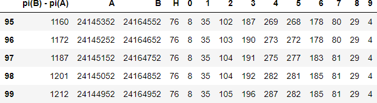
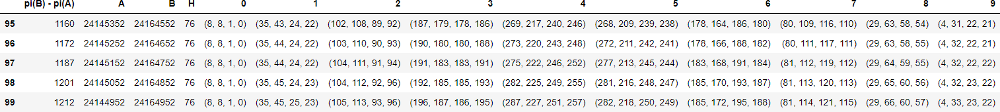
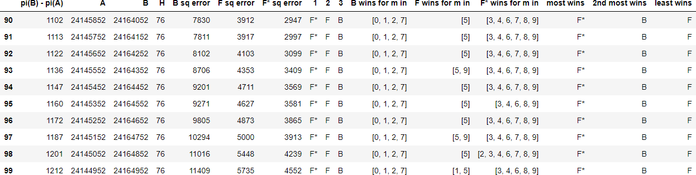
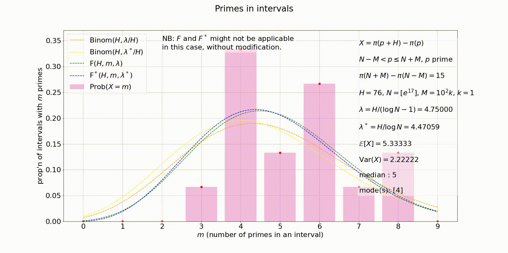
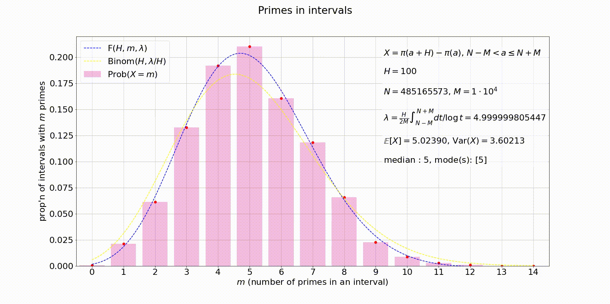

```python
import primes_in_intervals as pii
```

<sup>Jump to: ↓ [Example 2](#eg2) | ↓↓ [Example 3](#eg3) | ↓↓ [Example 4](#eg4) </sup>

<a id='eg1'></a>
**Example 1.** Tables from Gauss's _Nachlass_. Create data for primes in disjoint intervals of length $100$ (starting at multiples of $100$), up to $10^7$. Checkpoints every $10^5$.

By the bye, an interval of the form $[100k, 100k + 100)$ is referred to as a "Centade" in Gauss's _Nachlass_. Analogous to the term Decade (a 10-year period from years '0 to '9), a Centade is a 100-year period from '00 to '99. 

```python
C = list(range(0,10*10**6 + 1, 10**5))
H = 100
nachlass = pii.intervals(C,H,'disjoint')
```

Gauss and Goldschmidt summarize their data in tables of primes up to $1$ million, between $1$ and $2$ million, and so on. Let's emulate that.

```python
NACHLASS = { }
for i in range(1,11):
    NACHLASS[i] = pii.extract(nachlass, [(i - 1)*10**6, i*10**6] , option='narrow')
    pii.partition(NACHLASS[i])
```

Let's display one of these tables: the one for primes between $2$ and $3$ million.

```python
NACHLASS3df = pii.display(NACHLASS[3], count='partition', orient='columns')
pii.dfi.export(NACHLASS3df, 'NACHLASS3df.png')
```


Here's the original: Gauss/Goldschmidt were only short by $21$ primes in the end!


<sup>Jump to: ↑ [Example 1](#eg1) | ↓ [Plot](#eg2plot) | ↓ [Example 3](#eg3) | ↓↓ [Example 4](#eg4) </sup>

<a id='eg2'></a>
**Example 2.** Let's look at a series of nested intervals centred around $N = [e^{17}] = 24,154,952$. We take the density of primes close to $N$ as $1/(\log N - 1)$, which is $1/15.999999968802452\ldots$, virtually $1/16$. We'll get data for intervals of length $64, 68, 72, 76, 80$. 
```python
import numpy as np
N = int(np.exp(17))
HH = [64, 68, 72, 76, 80]
C = list(range(N - 10**4,N + 10**4 + 1, 10**2))
EXP17 = {}
for H in HH:
    EXP17[H] = pii.intervals(C, H, 'overlap')
```
Right now we have data for the intervals $(N  - 10^4, N - 10^4 + 100k]$, $k = 1,\ldots,100$. Let's reconfigure the data to consider nested intervals $(N - 100k, N + 100k]$, $k = 1,\ldots,100$, all centred around $N$. We'll analyze the data (get the distributions and statistics) while we're at it.

```python
EXP17NEST = {}
for H in HH:
    EXP17NEST[H] = pii.nest(EXP17[H])
    pii.analyze(EXP17NEST[H])
```

Let's display what we have for $H = 76$ for instance.

```python
EXP17_76_NESTtable = pii.display(EXP17NEST[76])
pii.dfi.export(EXP17_76_NESTtable, 'EXP17_76_NESTtable.png')
```


Let's compare the data (for $H = 76$) to three predictions: the Binomial, our prediction, and the alternate version of our prediction (with the density of primes around $N$ taken to be $1/\log N$). Specifically, with $\lambda = H/(\log N - 1)$ (and assuming $\lambda \asymp 1$), the naive prediction based purely on Cramér's model is

$$\mathrm{Binom}(H,\lambda/H) =  \frac{e^{-\lambda}\lambda^m}{m!}\bigg[1 + \frac{Q_1(\lambda,m)}{H} + \frac{Q_2(\lambda,m)}{H^2} + \cdots\bigg],$$
where each $Q_j(\lambda,m)$ is a polynomial in $\lambda$ and $m$, and in particular, 

$$Q_1(\lambda,m) = \frac{m - (m - \lambda)^2}{2}.$$

Our prediction is 

$$F(H,m,\lambda) = \frac{e^{-\lambda}\lambda^m}{m!}\left[1 + \frac{Q_1(\lambda,m)}{H}\left(\log H + (\log 2\pi + \gamma - 1)\right) \right].$$

Our alternative prediction is, with $\lambda^\* = 1/\log N$, 

$$F^\*(H,m,\lambda^\*) = \frac{e^{-\lambda^\*}(\lambda^\*)^m}{m!}\left[1 + \frac{\lambda^\*}{H}(m - \lambda^\*) + \frac{\log H + (\log 2\pi + \gamma - 1)}{H}Q_1(m,\lambda^\*) \right].$$

The table below shows tuples $(a,b,c,d)$, where $a$ is the actual number, $b$ is the Binomial-based prediction, $c$ is our prediction and $d$ is our alternative prediction. It would be nice to be able to conjecture something about a tertiary term!

We'll just show the last five rows of the table as it's a bit long and hard to read.

```python
pii.compare(EXP17NEST[76])
EXP17_76_NESTcompare = pii.display(EXP17NEST[76], comparisons='absolute').tail(5)
pii.dfi.export(EXP17_76_NESTcompare, 'EXP17_76_NESTcompare_tail.png')
```


We can perhaps work on the formatting of such tables.

Now, we want to know which prediction is the "best", and this is hard to see by glancing at the above table. By "best" we mean gives the smallest sum-of-squared-error over $m$ (number of primes in an interval). We're mainly interested in comparing $F$ and $F^\*$. Comparing $F^\*$ to the Binomial is not really apples-to-apples because the Binomial we are using takes the probability of finding a prime around $N$ as being $\lambda/H = 1/(\log N - 1)$, rather than $\lambda^\*/H = 1/\log N$, as in $F^\*$.

We'll use our ```winners``` function to determine the best predictions for each interval. For each prediction, this function also gives us the $m$ for which that prediction gives a smaller error than the others. 

```python
pii.winners(EXP17NEST[76])
EXP17_76_NESTwinners = pii.display(EXP17NEST[76], winners='show')
pii.dfi.export(EXP17_76_NESTwinners, 'EXP17_76_NESTwinners.png')
```


Finally, let's make an animated plot, with one frame for each of the intervals considered.

```python
import matplotlib.pyplot as plt # for plotting distributions
from matplotlib import animation # for animating sequences of plots
from matplotlib import rc # to help with the animation
from IPython.display import HTML # to save animations
from matplotlib.animation import PillowWriter # to save animations as a gif

# HH = [64, 68, 72, 76, 80]
X = EXP17NEST[HH[0]]

interval_type = X['header']['interval_type']
A = X['header']['lower_bound']
H = X['header']['interval_length']
C = list(X['distribution'].keys())

plt.rcParams.update({'font.size': 22})

fig, ax = plt.subplots(figsize=(22, 11))
fig.suptitle('Primes in intervals')

hor_axis = list(X['distribution'][C[-1]].keys())
y_min, y_max = 0, 0
for c in C:
    for m in X['distribution'][c].keys():
        if y_max < X['distribution'][c][m]:
            y_max = X['distribution'][c][m]
    
def plot(c):
    ax.clear()

    mu = X['statistics'][c]['mean']
    sigma = X['statistics'][c]['var']
    med = X['statistics'][c]['med']
    if med == int(med):
        med = int(med)
    modes = X['statistics'][c]['mode']
    
    # Bounds for the plot, and horizontal axis tick marks. 
    ax.set(xlim=(hor_axis[0]-0.5, hor_axis[-1]+0.5), ylim=(0,np.ceil(1000*y_max)/1000 ))

    # The data and histogram
    ver_axis = list(X['distribution'][c].values())
    ax.bar(hor_axis, ver_axis, color='#e0249a', zorder=2.5, alpha=0.3, label=r'$\mathrm{Prob}(X = m)$')
    ax.plot(hor_axis, ver_axis, 'o', color='red', zorder=2.5)  

    # Predictions for comparison
    A = c[0]
    B = c[1]
    N = (A + B)//2
    exponent= str(int(np.log(N)) + 1)
    M = N - A
    k = M//10**2
    p = 1/(np.log(N) - 1)
    x = np.linspace(hor_axis[0],hor_axis[-1],100)
    ax.plot(x, pii.binom_pmf(H,x,p), '--', color='orange', zorder=3.5, label=r'$\mathrm{Binom}(H,\lambda/H)$')
    ax.plot(x, pii.frei(H,x,H*p), '--', color='green', zorder=3.5, label=r'$\mathrm{F}(H,m,\lambda)$')
    
    # Overlay information
    if B != C[-1][1]:
        ax.text(0.75,0.15,fr'$X = \pi(a + H) - \pi(a)$' + '\n\n' 
                +  fr'$N - M < a \leq N + M$' + '\n\n' 
                + fr'$H = {H}$' + '\n\n' 
                + r'$N = [e^{17}]$' + '\n\n' 
                + fr'$M = 10^2k$, $k = {k}$' + '\n\n' 
                + fr'$\lambda = H/(\log N - 1) = {H*p:.5f}$' + '\n\n' 
                + r'$\mathbb{E}[X] = $' + f'{mu:.5f}' + '\n\n' 
                + r'$\mathrm{Var}(X) = $' + f'{sigma:.5f}' + '\n\n' 
                + fr'median : ${med}$' + '\n\n' 
                + fr'mode(s): ${modes}$', bbox=dict(facecolor='white', edgecolor='white', alpha=0.5), transform=ax.transAxes)
    if B == C[-1][1]:
        ax.text(0.75,0.15,fr'$X = \pi(a + H) - \pi(a)$' + '\n\n' 
                +  fr'$N - M < a \leq N + M$' + '\n\n' 
                + fr'$H = {H}$' + '\n\n' 
                + r'$N = [e^{17}]$' + '\n\n' 
                + fr'$M = 10^4$' + '\n\n' 
                + fr'$\lambda = H/(\log N - 1) = {H*p:.5f}$' + '\n\n' 
                + r'$\mathbb{E}[X] = $' + f'{mu:.5f}' + '\n\n' 
                + r'$\mathrm{Var}(X) = $' + f'{sigma:.5f}' + '\n\n' 
                + fr'median : ${med}$' + '\n\n' 
                + fr'mode(s): ${modes}$', bbox=dict(facecolor='white', edgecolor='white', alpha=0.5), transform=ax.transAxes)
    # Formating/labeling
    ax.set_xticks(hor_axis)
    ax.set_xlabel(r'$m$ (number of primes in an interval)')
    ax.set_ylabel('prop\'n of intervals with' + r' $m$ ' + 'primes')
    ax.legend(loc=2, ncol=1, framealpha=0.5)

    # A grid is helpful, but we want it underneath everything else. 
    ax.grid(True,zorder=0,alpha=0.7)   
    
# Generate the animation
X_anim = animation.FuncAnimation(fig, plot, frames=C, interval=100, blit=False, repeat=False)

# This is supposed to remedy the blurry axis ticks/labels. 
plt.rcParams['savefig.facecolor'] = 'white'

plot(C[-1])
plt.show()
```

The final frame looks like this:


Save the animation...

```python
HTML(X_anim.to_html5_video())
```
<a id='eg2plot'></a>


<sup>Jump to: ↑↑ [Example 1](#eg1) | ↓ [Plot](#(#eg3plot)) | ↑ [Example 2](#eg2) | ↓ [Example 4](#eg4) </sup>

<a id='eg3'></a>
**Example 3.** Let's go through the steps of [Example 2](#eg2), but instead of counting all intervals of the form $(a, a + H]$ as $a$ runs over all integers in the range $(N - M, N + M]$, let's consider only intervals of the form $(p, p + H]$ as $p$ runs over only the _primes_ in the range $(N - M, N + M]$. We have not yet worked through the details of the second-order term in our prediction in this case, but up to first order approximation we should still have $e^{-\lambda}\lambda^m/m!$...

First we generate the data using the ```'prime_start'``` option in our ```intervals``` function.
```python
N = int(np.exp(17))
HH = [64, 68, 72, 76, 80]
C = list(range(N - 10**4,N + 10**4 + 1, 10**2))
PSEXP17 = {}
for H in HH:
    PSEXP17[H] = pii.intervals(C, H, 'prime_start')
```

Let's centre the intervals around $N$ with the ```nest``` function.

```python
PSEXP17NEST = {}
for H in HH:
    PSEXP17NEST[H] = pii.nest(PSEXP17[H])
    pii.analyze(PSEXP17NEST[H])
```

Let's have a look at the data in a table.

```python
PSEXP17_76_NESTtable = pii.display(PSEXP17NEST[76])
PSEXP17_76_NESTtable
pii.dfi.export(PSEXP17_76_NESTtable.tail(5), 'PSEXP17_76_NESTtable.png')
```



Although our predictions have only been worked out for the case of overlapping intervals, and the secondary term in the case of disjoint/left-endpoint-prime intervals might well be a bit different, we can nevertheless compare the data to these "predictions"...

```python
pii.compare(PSEXP17NEST[76])
PSEXP17_76_NESTcompare = pii.display(PSEXP17NEST[76], comparisons='absolute').tail(5)
pii.dfi.export(PSEXP17_76_NESTcompare, 'PSEXP17_76_NESTcompare_tail.png')
```



...and see which not-really-a-prediction fares best...

```python
pii.winners(PSEXP17NEST[76])
PSEXP17_76_NESTwinners = pii.display(PSEXP17NEST[76], winners='show')
pii.dfi.export(PSEXP17_76_NESTwinners, 'PSEXP17_76_NESTwinners_tail10.png')
```


And now we can grok everything with an animation... Actually, these not-necessarily-predictions look half-decent, given that there are only about $1000$ intervals being used for the data.

```python
# HH = [64, 68, 72, 76, 80]
X = PSEXP17NEST[HH[3]]

interval_type = X['header']['interval_type']
A = X['header']['lower_bound']
H = X['header']['interval_length']
C = list(X['distribution'].keys())

plt.rcParams.update({'font.size': 22})

fig, ax = plt.subplots(figsize=(22, 11))
fig.suptitle('Primes in intervals')

hor_axis = list(X['distribution'][C[-1]].keys())
y_min, y_max = 0, 0
for c in C:
    for m in X['distribution'][c].keys():
        if y_max < X['distribution'][c][m]:
            y_max = X['distribution'][c][m]
    
def plot(c):
    ax.clear()

    mu = X['statistics'][c]['mean']
    sigma = X['statistics'][c]['var']
    med = X['statistics'][c]['med']
    if med == int(med):
        med = int(med)
    modes = X['statistics'][c]['mode']
    
    # Bounds for the plot, and horizontal axis tick marks. 
    ax.set(xlim=(hor_axis[0]-0.5, hor_axis[-1]+0.5), ylim=(0,np.ceil(100*y_max)/100 ))

    # The data and histogram
    ver_axis = list(X['distribution'][c].values())
    ax.bar(hor_axis, ver_axis, color='#e0249a', zorder=2.5, alpha=0.3, label=r'$\mathrm{Prob}(X = m)$')
    ax.plot(hor_axis, ver_axis, 'o', color='red', zorder=2.5)  

    # Predictions for comparison
    A = c[0]
    B = c[1]
    N = (A + B)//2
    exponent= str(int(np.log(N)) + 1)
    M = N - A
    k = M//10**2
    PI = sum(X['nested_interval_data'][c].values())
    p = 1/(np.log(N) - 1)
    p_alt = 1/(np.log(N))
    x = np.linspace(hor_axis[0],hor_axis[-1],100)
    ax.plot(x, pii.binom_pmf(H,x,p), '--', color='orange', zorder=3.5, label=r'$\mathrm{Binom}(H,\lambda/H)$')
    ax.plot(x, pii.binom_pmf(H,x,p_alt), '--', color='yellow', zorder=3.5, label=r'$\mathrm{Binom}(H,\lambda^*/H)$')
    ax.plot(x, pii.frei(H,x,H*p), '--', color='green', zorder=3.5, label=r'$\mathrm{F}(H,m,\lambda)$')
    ax.plot(x, pii.frei_alt(H,x,H*p_alt), '--', color='blue', zorder=3.5, label=r'$\mathrm{F^*}(H,m,\lambda^*)$')
    
    # Overlay information
    ax.text(0.25,0.90,r'NB: $F$ and $F^*$ might not be applicable' + '\n' + 'in this case, without modification.', bbox=dict(facecolor='white', edgecolor='white', alpha=0.5), transform=ax.transAxes)
    if B != C[-1][1]:
        ax.text(0.75,0.15,fr'$X = \pi(p + H) - \pi(p)$' + '\n\n' 
                +  fr'$N - M < p \leq N + M$, $p$ prime' + '\n\n' 
                + fr'$\pi(N + M) - \pi(N - M) = {PI}$'+ '\n\n'
                + fr'$H = {H}$, '   
                + r'$N = [e^{17}]$, '   
                + fr'$M = 10^2k$, $k = {k}$' + '\n\n' 
                + fr'$\lambda = H/(\log N - 1) = {H*p:.5f}$' + '\n\n'
                + fr'$\lambda^* = H/\log N = {H*p_alt:.5f}$' + '\n\n'
                + r'$\mathbb{E}[X] = $' + f'{mu:.5f}' + '\n\n' 
                + r'$\mathrm{Var}(X) = $' + f'{sigma:.5f}' + '\n\n' 
                + fr'median : ${med}$' + '\n\n' 
                + fr'mode(s): ${modes}$', bbox=dict(facecolor='white', edgecolor='white', alpha=0.5), transform=ax.transAxes)
    if B == C[-1][1]:
        ax.text(0.75,0.15,fr'$X = \pi(p + H) - \pi(p)$' + '\n\n' 
                +  fr'$N - M < p \leq N + M$, $p$ prime' + '\n\n' 
                + fr'$\pi(N + M) - \pi(N - M) = {PI}$'+ '\n\n'
                + fr'$H = {H}$, '   
                + r'$N = [e^{17}]$, '  
                + fr'$M = 10^4$' + '\n\n' 
                + fr'$\lambda = H/(\log N - 1) = {H*p:.5f}$' + '\n\n' 
                + fr'$\lambda^* = H/\log N = {H*p_alt:.5f}$' + '\n\n' 
                + r'$\mathbb{E}[X] = $' + f'{mu:.5f}' + '\n\n' 
                + r'$\mathrm{Var}(X) = $' + f'{sigma:.5f}' + '\n\n' 
                + fr'median : ${med}$' + '\n\n' 
                + fr'mode(s): ${modes}$', bbox=dict(facecolor='white', edgecolor='white', alpha=0.5), transform=ax.transAxes)
    # Formating/labeling
    ax.set_xticks(hor_axis)
    ax.set_xlabel(r'$m$ (number of primes in an interval)')
    ax.set_ylabel('prop\'n of intervals with' + r' $m$ ' + 'primes')
    ax.legend(loc=2, ncol=1, framealpha=0.5)

    # A grid is helpful, but we want it underneath everything else. 
    ax.grid(True,zorder=0,alpha=0.7)   
    
# Generate the animation
X_anim = animation.FuncAnimation(fig, plot, frames=C, interval=100, blit=False, repeat=False)

# This is supposed to remedy the blurry axis ticks/labels. 
plt.rcParams['savefig.facecolor'] = 'white'

plot(C[-1])
plt.show()
```

```python
HTML(X_anim.to_html5_video())
```
<a id='eg3plot'></a> 



<sup>Jump to: ↑↑ [Example 1](#eg1) | ↑↑ [Example 2](#eg2) | | ↑ [Example 3](#eg3) </sup>

<a id='eg4'></a>
**Example 4.** We use $\lambda = H/(\log N - 1)$ in our prediction $F(H,m,\lambda)$ because the density of primes close to $N$ is approximately $1/(\log N - 1)$, by the prime number theorem. Actually, the prime number theorem says that the number of primes up to $N$ is well-approximated by 

$$\int_2^N \frac{dt}{\log t} = \frac{N}{\log N} + \frac{N}{(\log N)^2} + \frac{2N}{(\log N)^3} + \cdots .$$

Thus, the average density of primes up to $N$ is approximated by 

$$\frac{1}{N} \int_2^N \frac{dt}{\log t} = \frac{1}{\log N} + \frac{1}{(\log N)^2} + \frac{2}{(\log N)^3} + \cdots .$$

(Indeed, Gauss's observation from his numerical data was that the density of primes around $n$ is around $1/\log n$, so that the number of primes around $N$ may be estimated by integrating over this density.) Notice that 

$$\frac{1}{\log N - 1} = \frac{1}{\log N} + \frac{1}{(\log N)^2} + \frac{1}{(\log N)^3} + \cdots, $$

and so $1/(\log N - 1)$ is a good proxy for what the prime number theorem gives us: more precisely, 

$$\frac{1}{N} \int_2^N \frac{dt}{\log t} = \frac{1}{\log N - 1} + O\left(\frac{1}{(\log N)^3}\right).$$

In fact, the details leading to our prediction $F(H,m,\lambda)$ are unaffected if, instead of letting $\lambda = H/(\log N - 1)$, we let $\lambda = H/(\log N - 1 + \epsilon(N))$, where $\epsilon(N) \to 0$ rapidly enough. (This is also related to the reason why, if we let $\lambda^\* = H/\log N$, which only approximates what we get from the logarithmic intgral up to an error of $O(1/(\log N)^2$, we get a different form for our prediction, which we are calling $F^\*(H,m,\lambda^\*)$.) That is, we can use better approximations than $1/(\log N - 1)$ to the density of primes close to $N$, but this does not affect the form of our prediction $F(H,m,\lambda)$, because $\epsilon(N)$ gets absorbed into our error terms. If we could work out or conjecture tertiary and higher order terms in our prediction $F(H,m,\lambda)$, this would become quite relevant and interesting. 

Notwithstanding, we can still play around with $\lambda$ in our numerics. The prime number theorem suggests that if we are considering primes in intervals around $(N - M, N + M]$, we should take the density of primes (or "probability" of a random integer in the interval being prime) as 

$$\frac{1}{2M} \int_{N - M}^{N + M} \frac{dt}{\log t}.$$

Again, letting this be $\lambda/H$ doesn't affect the form of our prediction $F(H,m,\lambda)$. Below is an animated plot, where we chose $N$ so that the above with $M = 10^6$ is very close to $1/20$.



What we should really like to do is, instead of fixing $H$ and letting $\lambda = H/(\log N - 1)$ (or whatever), and considering intervals close enough to $N$ that $\lambda$ remains more or less constant, is _fix_ $\lambda$, and let $H = \lambda \log n$ (say), where we are considering intervals of the form $(n, n + H]$. Then we'd have $\lambda/H = 1/\log n$, and this is what the prime number theorem (and Gauss) really say: the density of primes around an integer $n$ is $1/\log n$. Alas, for now, the argument leading to our prediction relies on the fact that $H$ is a fixed integer.


